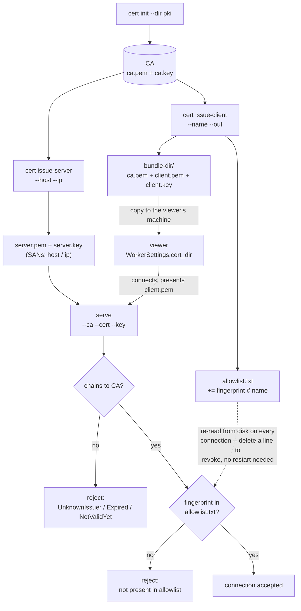

# indicatrix-worker

Headless server and CLI for a `indicatrix` design library.

`serve` is, by default, a **design-library server**: it answers read-only catalogue
queries — search, filter options, fetch a design, fetch an attachment — over mutual
TLS, so a viewer on another machine can browse or mirror the library. Rendering is
*optional* on top of that, behind an off-by-default `worker` feature; with it
enabled the same connection also accepts `RenderRequest`s and streams traced samples
back. `WELCOME` tells a client which of the two this instance actually offers, so it
never has to discover the answer by being refused.

`render` traces a scene straight to a PNG in one shot, with no networking. `cert`
manages the private CA that `serve`'s mutual TLS depends on, including one-time
enrollment tokens so a viewer never needs a bundle copied to it by hand.

| Feature | Default | Adds |
|---|---|---|
| *(none)* | ✅ | Library server, `cert`, mutual TLS, enrollment |
| `worker` | off | Render capacity — `RenderRequest`, `render`, `Backend` advertisement |
| `gpu` | off | GPU tracing; implies `worker`, since GPU without render capacity is meaningless |

A default build does not compile `indicatrix` in at all — see [GPU](#gpu).

## Icon, and why this binary keeps its console

`build.rs` embeds `assets/icon.ico` as a Windows resource — emerald, so it is
distinguishable from `indicatrix-cut`'s cyan at a glance. Regenerate both with
`python scripts/make-icons.py`.

There is deliberately **no** `windows_subsystem = "windows"` here, unlike `indicatrix-cut`.
This is a command-line tool: `render` prints progress, `serve` streams `tracing` output
for the life of the server, and `cert` prints fingerprints an operator has to read.
Marking it a Windows-subsystem binary would detach stdout from the parent console, so
`indicatrix-worker serve` run from a terminal would print nothing at all. The icon is
cosmetic; the console is the interface.

## Documentation map

This file is the operator's reference: how to build it, every command and flag, both
certificate workflows, and troubleshooting. Two companion documents hold the material
that doesn't belong in a command reference:

- [`docs/security.md`](docs/security.md) — the trust model. Who may connect and how,
  both enrollment paths and what a stolen token would get an attacker, what each
  security-relevant flag weakens, and what this explicitly does *not* protect against.
- [`docs/architecture.md`](docs/architecture.md) — how it works inside. The
  tracer/emitter split, cancellation and `request_id` epochs, the threading model, and
  the GPU backend, with diagrams.

## Install / build

```
cargo build -p indicatrix-worker --release
```

Produces `target/release/indicatrix-worker(.exe)`. All examples below assume you're
running from the workspace root via `cargo run -p indicatrix-worker --`; substitute
the built binary directly if you prefer.

## Command reference

Argument parsing is hand-rolled (no `clap`) — `-h`/`--help` anywhere in the
argument list, or no arguments at all, prints help and exits; this is verified
behavior, not a guess. Help is split by topic rather than one combined blob:
`indicatrix-worker --help` prints a short page listing the three subcommands,
`indicatrix-worker render --help` / `serve --help` / `cert --help` print only that
subcommand's own flags, and `indicatrix-worker cert <sub-command> --help` drills
one level further into `cert`'s five sub-subcommands. The combined usage lines
below are a README convenience, not what any single `--help` invocation prints.

```
indicatrix-worker render --scene <scene.json> --out <render.png> --width <px> --height <px> --samples <n> [--threads <n>] [--only-gpu | --only-cpu]
indicatrix-worker serve  [--bind <host:port>] [--threads <n>] [--allow-remote] [--only-gpu | --only-cpu] [--db <path>]
                     --ca <ca.pem> --cert <server.pem> --key <server.key> [--allowlist <path>] [--trust-any-client-cert]
                     [--enroll-bind <host:port>] [--no-enroll]
indicatrix-worker serve  [--bind <host:port>] [--threads <n>] [--allow-remote] [--only-gpu | --only-cpu] [--db <path>] --insecure-no-tls

indicatrix-worker cert init         --dir <pki-dir>
indicatrix-worker cert issue-server --dir <pki-dir> --host <name> [--host <name> ...] --ip <addr> [--ip <addr> ...]
indicatrix-worker cert issue-client --dir <pki-dir> --name <label> --out <bundle-dir>
indicatrix-worker cert issue-token  --ca <ca.pem> --admin-addr <host:port> --name <label>
indicatrix-worker cert claim        --token <token> --addr <host:port> --out <bundle-dir>
```

### `render` — trace a scene straight to a PNG, no networking

| Flag | Required | Meaning |
|---|---|---|
| `--scene <path>` | yes | JSON-encoded `indicatrix_net::SceneState`. Its own `width`/`height` fields, if present, are **ignored** — `--width`/`--height` are authoritative, so the same `scene.json` can be re-rendered at different resolutions without editing it. |
| `--out <path>` | yes | Output PNG path. Parent directories are created if missing. |
| `--width <px>` | yes | Output image width. |
| `--height <px>` | yes | Output image height. |
| `--samples <n>` | yes | Total samples per pixel to trace. Capped at 1,000,000 (a fat-finger guard, not a real limit — traced once, locally, by an invocation you already trust). |
| `--threads <n>` | no | CPU threads to use. Default (`0`, or omitted): all available cores. |
| `--only-gpu` / `--only-cpu` | no | Force a single engine — GPU only (rejected without the `gpu` feature) or CPU only. Mutually exclusive. Default (neither given): hybrid CPU+GPU — see SERVE's `--only-gpu` entry below for what that means. |

`render` deliberately exists as the simpler path, built and tested before
`serve`: it exercises the whole trace → validate → tone-map → PNG pipeline with
nothing networked to debug at the same time, and has standalone value of its own
— batch-rendering stills without running the interactive editor.

**Getting a `scene.json`.** A `SceneState` is a fully-resolved scene (real facet
planes and a real material, never a name or a database id — see `indicatrix-net`'s
README for why). In practice you get one by exporting from the `indicatrix-cut`
editor, or by constructing one programmatically with `indicatrix`'s public API and
serializing it:

```rust
use indicatrix::{geometry::cuts::StandardGemCuts, optics::materials::GemMaterial, optics::raytracer::LightingPreset};
use indicatrix_net::SceneState;

let scene = SceneState {
    width: 800, height: 600,
    yaw: 0.4, pitch: 0.3, distance: 3.0,
    light_yaw: 0.85, light_pitch: 0.95, exposure: 1.0,
    max_bounces: 6,
    lighting_preset: LightingPreset::Daylight,
    material: GemMaterial::diamond(),
    planes: StandardGemCuts::standard_round_brilliant(),
};
std::fs::write("scene.json", serde_json::to_string_pretty(&scene)?)?;
# Ok::<(), Box<dyn std::error::Error>>(())
```

Verified end-to-end example (real command, run against a scene built the way
above):

```
indicatrix-worker render --scene scene.json --out render.png --width 800 --height 600 --samples 16
```

produces a real 800x600 PNG at the given path (confirmed by running it).

### `serve` — serve the design library, and optionally render

Requires **mutual TLS by default** — both sides must present a certificate
signed by the same private CA (see [Workflow A](#workflow-a--manual-bundle-copy-verified-end-to-end)
below).

What one instance offers depends on how it was built. A default build serves the
**library** protocol only; a `worker` build serves both. `WELCOME` advertises this
(`library: bool`, `render: Option<RenderCapability>`) so a client checks rather than
guesses — and a `RenderRequest` arriving at a library-only server is answered with a
protocol error rather than a dropped connection, since nothing stops a peer sending
one regardless of what was advertised.

| Flag | Default | Meaning |
|---|---|---|
| `--bind <host:port>` | `127.0.0.1:7878` | Listen address. Loopback-only unless `--allow-remote` is also given. |
| `--threads <n>` | `0` (all cores) | CPU threads used **per render request**. Governs only the CPU tracer — the GPU path is a single dispatch, not a thread fan-out — but still applies to its CPU fallback. `worker` builds only. |
| `--db <path>` | `facet_diagrams.sqlite` in the working directory | The design library to serve. Opened **read-only**; this role never writes. The default is deliberate — it matches where the viewer looks — and `--db` exists for long-running servers that shouldn't depend on their launch directory. |
| `--only-gpu` | off | GPU only — never splits work onto the CPU tracer for any request, even when the hybrid split would otherwise have been offered one. Still falls back to the CPU tracer for a request/sub-batch the GPU itself declines. Rejected at parse time on a binary built without the `gpu` feature. Mutually exclusive with `--only-cpu`. |
| `--only-cpu` | off | Force the CPU tracer even on a `gpu` build with a working adapter. For A/B comparison, or routing around a misbehaving one. `WELCOME` then honestly reports `Backend::Cpu`. Mutually exclusive with `--only-gpu`. What `--no-gpu` (removed) used to do. Default (neither flag given): hybrid CPU+GPU — CPU and GPU trace concurrently whenever the measured split is worth it, automatically falling back to GPU-only when it isn't (see [Architecture](docs/architecture.md#gpu)). |
| `--enroll-bind <host:port>` | `--bind`'s host, one port up | Listener for token enrollment (see `cert issue-token` / `cert claim`). Same loopback / `--allow-remote` gate as `--bind`. Ignored with `--insecure-no-tls` — there is no CA to enroll against. |
| `--no-enroll` | off | Don't open the enrollment listener at all. The manual `cert issue-client` bundle-copy path still works. |
| `--allow-remote` | off | Required to bind any non-loopback address, TLS or not — exposing this worker beyond localhost must be an explicit, visible choice. |
| `--ca <path>` | — | CA certificate that issued both `--cert` and every trusted client certificate. Required unless `--insecure-no-tls`. |
| `--cert <path>` | — | This worker's own certificate (from `cert issue-server`). |
| `--key <path>` | — | This worker's own private key. |
| `--allowlist <path>` | `allowlist.txt` next to `--ca` | SHA-256 fingerprints of trusted client certificates, one per line (see `cert issue-client`). Re-read from disk on **every connection** — editing it takes effect immediately, no restart. |
| `--trust-any-client-cert` | off | Skip the fingerprint allowlist — trust any client whose certificate chains to `--ca`. Off by default deliberately: the allowlist decides *which* signed clients may connect, not just which CA signed them, so skipping that check is required to be explicit, never a silent default. |
| `--insecure-no-tls` | off | Serve plaintext, no TLS, no authentication at all. Refused on a non-loopback `--bind`. Every connection accepted this way logs a warning. For local debugging only. |

Minimal loopback example, no TLS setup needed:

```
indicatrix-worker serve --insecure-no-tls
```

Real remote example, once certificates exist (see below):

```
indicatrix-worker serve --ca pki\ca.pem --cert pki\server.pem --key pki\server.key --allow-remote --bind 0.0.0.0:7878
```

(`--allowlist` defaults to `pki\allowlist.txt`, next to `--ca`, and already
contains whatever `cert issue-client` runs have added to it.)

### `cert` — manage an in-process private CA for `serve`'s mutual TLS

There is no CRL or OCSP. **Revoking a client is deleting its line from the
allowlist file**; the allowlist is re-read on every connection, so this takes
effect without restarting `serve`.

There are two ways to get a certificate onto a viewer's machine: copy a bundle by hand
(`issue-client`), or read out a one-time token (`issue-token` + `claim`). Both are
supported and neither is deprecated — see the workflows below, and
[`docs/security.md`](docs/security.md) for the trust model, what a stolen token would
get an attacker, and the known limitation that the client's private key currently
transits the wire.

| Subcommand | Required flags | Does |
|---|---|---|
| `cert init` | `--dir <pki-dir>` | Generates a new CA keypair + self-signed certificate (10-year lifetime) in `--dir`. **Refuses to run if `--dir` already has one** (regenerating it would invalidate every certificate already issued from it) — there is no `--force`. |
| `cert issue-server` | `--dir <pki-dir>`, at least one of `--host <name>` / `--ip <addr>` (both repeatable) | Issues this worker's certificate (5-year lifetime), signed by the CA in `--dir`. `--host`/`--ip` become Subject Alternative Names — TLS ignores Common Name entirely, so a viewer connecting by IP address specifically needs an `--ip` SAN, not just a `--host` DNS name. |
| `cert issue-client` | `--dir <pki-dir>`, `--name <label>`, `--out <bundle-dir>` | Issues one viewer's certificate (5-year lifetime), signed by the CA in `--dir`, and writes a self-contained bundle (`ca.pem`, `client.pem`, `client.key`) to `--out` for copying to that viewer's machine. Also computes the certificate's SHA-256 fingerprint and appends it to `<pki-dir>/allowlist.txt`, labeled with `--name`. |
| `cert issue-token` | `--ca <ca.pem>`, `--admin-addr <host:port>`, `--name <label>` | Asks a **running** `serve` for a one-time, **180-second** enrollment token and prints it. The certificate is minted immediately but held in that process's memory — nothing on disk, nothing in the allowlist, until it is claimed. Honoured only from a loopback peer. |
| `cert claim` | `--token <token>`, `--addr <host:port>`, `--out <bundle-dir>` | Redeems a token on the machine being enrolled, writing the same three-file bundle `issue-client` would. Verifies the worker against the CA fingerprint carried in the token **before** sending the secret. Single use. |

**Directory layout** (`--dir`):

```
<pki-dir>/
  ca.pem          CA certificate (public)
  ca.key          CA private key (sensitive — ACL-restricted; on Windows, restricted via icacls to the current user + SYSTEM + Administrators)
  server.pem      this worker's certificate (public)
  server.key      this worker's private key (sensitive)
  allowlist.txt   trusted client-certificate fingerprints, one per line, "# label" comments allowed
```



The bundle-copying step is the one manual, out-of-band step in the whole
chain: `issue-client` writes `bundle-dir/{ca.pem,client.pem,client.key}` next
to the worker's own `pki/`, and getting that viewer working means physically
moving those three files to the viewer's machine (nothing here does that for
you). Revocation is the mirror image — deleting a client's line from
`allowlist.txt` is the entire mechanism, re-read on the very next connection
attempt.

Every certificate's `not_before` is backdated by one day from the moment of
issuance, to absorb clock skew between the machine that issued it and whichever
machine (worker or viewer) checks its validity later — otherwise a viewer whose
clock is a little behind the issuing machine's would reject a certificate that
was, from its own clock's point of view, "not yet valid."

#### Workflow A — manual bundle copy, verified end to end

For air-gapped or offline setups, or any time nothing can dial out to a running `serve`.

```
indicatrix-worker cert init --dir pki
# INFO indicatrix_worker::pki: indicatrix-worker cert init: wrote pki\ca.pem and pki\ca.key -- CA expires <date+10y> (UTC)

indicatrix-worker cert issue-server --dir pki --host localhost --ip 127.0.0.1
# INFO indicatrix_worker::pki: indicatrix-worker cert issue-server: wrote pki\server.pem and pki\server.key (SANs: localhost, 127.0.0.1) -- expires <date+5y> (UTC)

indicatrix-worker cert issue-client --dir pki --name my-laptop --out bundle-my-laptop
# INFO indicatrix_worker::pki: indicatrix-worker cert issue-client: wrote bundle to bundle-my-laptop (ca.pem, client.pem, client.key)
#      -- fingerprint <64 hex chars> added to pki\allowlist.txt -- expires <date+5y> (UTC)

# copy bundle-my-laptop/{ca.pem,client.pem,client.key} to the viewer's machine
# (this is exactly what apps/indicatrix-cut's WorkerSettings.cert_dir should point at)

indicatrix-worker serve --ca pki\ca.pem --cert pki\server.pem --key pki\server.key --allow-remote --bind 0.0.0.0:7878
```

`pki\allowlist.txt` after the `issue-client` step above looks like:

```
e60856fac53419a890272d5fdeb07c9aad7280cf8e32bf13ad215256fc7e7f4  # my-laptop
```

#### Workflow B — one-time enrollment token

No files to copy. The CA and server steps are identical to Workflow A; only the
per-viewer step changes.

```
# On the worker: serve is already running, and logged its enrollment listener at startup.
indicatrix-worker serve --ca pki\ca.pem --cert pki\server.pem --key pki\server.key                     --allow-remote --bind 0.0.0.0:7878

# On the worker, in another shell -- loopback only, uses the CA file you already have:
indicatrix-worker cert issue-token --ca pki\ca.pem --admin-addr 127.0.0.1:7879 --name my-laptop
# GW1-XXXXX-XXXXX-...   (valid 180 seconds, single use)

# On the machine being enrolled, within 180 seconds:
indicatrix-worker cert claim --token GW1-XXXXX-XXXXX-... --addr worker.example:7879 --out certs
# writes certs/{ca.pem,client.pem,client.key} -- the same layout Workflow A produces,
# so indicatrix-cut's WorkerSettings.cert_dir works unchanged either way
```

The allowlist gains its entry **at claim time, not at issue time** — an unclaimed or
expired token leaves no trace and grants nothing. `serve` needs read access to `ca.key`
for this (signing a certificate requires it), which it did not before; `--no-enroll`
opts out entirely and keeps Workflow A.


## Architecture notes

Moved to [`docs/architecture.md`](docs/architecture.md): the tracer/emitter split (and
why emission is decoupled from sample production), cancellation and `request_id` epochs,
the per-connection threading model, and the GPU backend. Three Mermaid diagrams live
there.

## Limits and validation

Both `render` and `serve` validate their input before it reaches `indicatrix`'s
tracer — the worker is a network service accepting caller-supplied geometry
(`serve`) and a CLI tool accepting a caller-supplied scene file (`render`), and
neither should hand attacker- or fat-finger-controlled numbers straight through.

| Limit | Value | Applies to |
|---|---|---|
| Max pixels (`width * height`) | 7680×4320 (8K UHD) | both |
| Max samples per `render` invocation | 1,000,000 | `render` (fat-finger guard) |
| Max samples per `serve` request | 65,536 | `serve` (one batch out of a larger accumulation — a real DoS bound, much smaller than `render`'s) |
| Max bounces | 128 | both |
| Plausible refractive index | 1.0 – 6.0, checked at 380nm/589.3nm/780nm | both |

A `serve` request that fails validation gets `StreamEvent::Error` on the
existing connection, not a dropped socket; a trace that panics anyway (validation
passed but the geometry was pathological) is caught and also reported as an
`Error`, connection kept open.

## Logging

`indicatrix-worker` initializes `tracing_subscriber` from `RUST_LOG`
(`EnvFilter::try_from_default_env()`), falling back to `info` if it's unset or
unparsable (`src/main.rs`). Nothing else needs to be configured for this to
work — set the variable before running either subcommand:

```
RUST_LOG=debug indicatrix-worker serve --insecure-no-tls
```

The default `info` level already surfaces the events most worth seeing —
accept-loop and TLS-handshake failures, allowlist rejections, and validation
errors are all logged at `warn` or above (see
[Troubleshooting](#troubleshooting) below, most of which is visible without
touching `RUST_LOG` at all). `debug` adds the finer-grained, per-connection
detail `info` leaves out, such as `serve` receiving a `CANCEL` for a
`request_id` that isn't currently streaming on that connection (logged and
ignored rather than treated as an error — see
[Cancellation](#cancellation)). Module-scoped filters work too (e.g.
`RUST_LOG=indicatrix_worker::serve=debug` to raise only the accept loop and
connection handler without the rest of the crate), since `EnvFilter` accepts
the usual `tracing_subscriber` filter syntax.

## Troubleshooting

- **`error: "serve" requires --ca <path> unless --insecure-no-tls is set`** — you
  need either the three TLS flags (`--ca`/`--cert`/`--key`) or `--insecure-no-tls`.
- **`refusing to bind non-loopback address ... without --allow-remote`** — add
  `--allow-remote`, or bind to `127.0.0.1`.
- **Worker refuses to pair with a viewer (build/protocol mismatch)** — the
  `HELLO`/`WELCOME` handshake compares `indicatrix::BUILD_ID` and the wire protocol
  version; any mismatch is refused unconditionally, with no "close enough" tier.
  Rebuild both sides from the same source tree. See `indicatrix-net`'s README for why
  this check can't be relaxed.
- **`rejecting client certificate <fingerprint>: not present in <allowlist path>`**
  — run `cert issue-client` for that viewer (which also adds its fingerprint to
  the allowlist), or pass `--trust-any-client-cert` to skip the check entirely
  (loses per-client revocability). This is logged at `warn`, and the allowlist
  size `serve` loaded at startup is logged at `info`, so both are visible at
  the default log level — see [Logging](#logging) if you've set `RUST_LOG` to
  something quieter (e.g. `error`) and need to turn it back up to see them.
- **TLS handshake failures** (`NotValidYet`, `Expired`, `UnknownIssuer`) are
  logged with `rustls`'s own error text rather than collapsed to a generic
  message — a `NotValidYet` error on a certificate issued moments ago usually
  means clock skew between the two machines wider than the one-day backdating
  absorbs. Like the allowlist rejection above, this is a `warn`-level log
  visible by default; see [Logging](#logging) if it isn't showing up.
- **`cert init` refuses, saying a CA already exists** — there's no `--force`;
  delete `ca.pem`/`ca.key` yourself first if you really mean to start over
  (understanding this invalidates every certificate already issued from that CA).

## Testing

```
cargo test -p indicatrix-worker
```

**71 tests** on a default (library-only) build, **161** with `--features worker`, and
**164** with `--features gpu`. Six of the `worker`/`gpu` totals are `#[ignore]`d — they
need a real GPU adapter, so `cargo test` skips them unless you pass `--ignored`. Inline
`#[cfg(test)]` throughout the crate, not concentrated in one or two files:

| Module | Default | `worker` | `gpu` | Covers |
|---|---|---|---|---|
| `cli/` | 37 | 37 | 37 | argument parsing for every subcommand, per-topic `-h`/`--help` resolution, error messages for missing/malformed flags |
| `serve/` | 14 | 39 | 41 | the `HELLO`/`WELCOME` handshake (including a build-hash mismatch), request validation keeping the connection open, real loopback round trips, delta tiling, `FinalOnly` still emitting `PROGRESS`, `CANCEL` mid-stream, stale `request_id` identifiability, the pipelined-`RenderRequest`-as-implicit-cancel path, the `TILT_CURVES` request/response family, and the library request/response dispatch |
| `validate/` | — | 26 | 26 | every limit in the table above, both accepted and rejected |
| `stream_emit/` | — | 16 | 16 | delta coalescing, adaptive sub-batch sizing, preview downsampling, effective-cadence averaging, and the write-timeout/backpressure paths |
| `render_core/` | — | 12 | 12 | including that single- and multi-threaded traces agree bit-exactly, that splitting a sample range across two calls sums to the same result as one, and the CPU+GPU hybrid split |
| `enroll/` | 9 | 10 | 10 | the token registry: single use, expiry, wrong token, allowlist-only-after-claim, loopback-only issuing, the pending cap, and that a claim connection cannot serve a render request |
| `pki/` | 7 | 7 | 7 | the certificate workflow |
| `render_cmd/` | — | 7 | 8 | including a real, fast end-to-end smoke test running the full JSON-load → validate → trace → tone-map → PNG-encode path at 8×8 @ 4spp |
| `enroll_client/` | 4 | 4 | 4 | two real loopback-TLS round trips through the actual pinning verifier — one successful claim, one refusing a token whose CA fingerprint does not match the server |
| `png_out/` | — | 3 | 3 | PNG encoding of a traced buffer |
| `png_out/` | 3 | — |

The `GW1-` token codec and the CA-pinning claim client moved to `crates/indicatrix-net`
(`token`, `enroll`) when the viewer needed them too — their tests went with them.

Almost nothing here needs real I/O. `serve.rs`'s tests drive `handle_connection` over
an in-memory duplex double or a loopback `TcpStream` with TLS skipped entirely, and
`pki.rs` exercises certificate generation and ACL-setting without starting `serve` — so
the suite runs in well under a second with no port conflicts and no certificates to
provision.

The two exceptions are deliberate. `enroll_client.rs` performs **real loopback TLS
handshakes**, because the thing under test is the pinning verifier itself: that it
accepts a server whose chain matches the token's CA fingerprint and refuses one that
doesn't. Mocking the handshake there would test the mock. They still need no external
network and no provisioned certificates — both ends are generated in-process.
