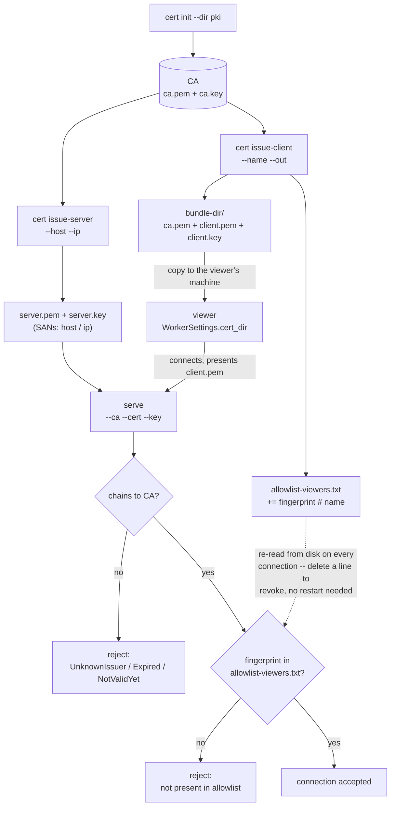

# indicatrix-worker

Headless server and CLI for a `indicatrix` design library.

`serve` is the **coordinator**. It always answers read-only catalogue queries —
search, filter options, fetch a design, fetch an attachment — over mutual TLS, so a
viewer on another machine can browse or mirror the library. Rendering is *optional*
on top of that, behind an off-by-default `worker` feature: a `worker` build also
accepts render workers that `join` it on a separate worker port, spreads viewers'
render requests over them, and — only when started with `--render` — renders with
its own CPU/GPU too. `WELCOME` tells a client what this instance actually offers, so
it never has to discover the answer by being refused.

`render` traces a scene straight to a PNG in one shot, with no networking. `cert`
manages the private CA that `serve`'s mutual TLS depends on, including one-time
enrollment tokens so a viewer never needs a bundle copied to it by hand. `join`
(`worker` builds) turns a machine into a render worker that dials OUT to a coordinator.

> **Release note (coordinator mode): `serve` no longer renders by default.** `serve`
> is now the *coordinator*: it always serves the library and accepts `join`ing workers
> on a separate worker port, but it renders with its own CPU/GPU only when started
> with **`--render`** (or `--only-gpu` / `--only-cpu`, which imply it). An existing
> single-worker setup must add `--render` to keep rendering. Viewer allowlists move to
> `allowlist-viewers.txt`; an existing `allowlist.txt` keeps working as the viewers
> list until that file exists.

| Feature | Default | Adds |
|---|---|---|
| *(none)* | ✅ | Library server, `cert`, mutual TLS, enrollment |
| `worker` | off | Render capacity — `RenderRequest`, `render`, `join`, the coordinator's worker port, `Backend` advertisement |
| `gpu` | off | GPU tracing; implies `worker`, since GPU without render capacity is meaningless |

A default build does not compile `indicatrix` in at all — see [GPU](#gpu).

## Icon, and why this binary keeps its console

`build.rs` embeds `assets/icon.ico` as a Windows resource — emerald, so it is
distinguishable from `indicatrix-cut`'s cyan at a glance. Regenerate both with
`python scripts/make-icons.py`.

There is deliberately **no** `windows_subsystem = "windows"` here, unlike `indicatrix-cut`.
This is a command-line tool: `render` prints progress, `serve` streams `tracing` output
for the life of the server, and `cert` prints fingerprints an operator has to read.
Marking it a Windows-subsystem binary would detach stdout from the parent console, so
`indicatrix-worker serve` run from a terminal would print nothing at all. The icon is
cosmetic; the console is the interface.

## Documentation map

This file is the operator's reference: how to build it, every command and flag, both
certificate workflows, and troubleshooting. Two companion documents hold the material
that doesn't belong in a command reference:

- [`docs/security.md`](docs/security.md) — the trust model. Who may connect and how,
  both enrollment paths and what a stolen token would get an attacker, what each
  security-relevant flag weakens, and what this explicitly does *not* protect against.
- [`docs/architecture.md`](docs/architecture.md) — how it works inside. The
  tracer/emitter split, cancellation and `request_id` epochs, the threading model, the
  coordinator's job execution over joined workers, and the GPU backend, with diagrams.

## Install / build

```
cargo build -p indicatrix-worker --release
```

Produces `target/release/indicatrix-worker(.exe)`. All examples below assume you're
running from the workspace root via `cargo run -p indicatrix-worker --`; substitute
the built binary directly if you prefer.

## Command reference

Argument parsing is hand-rolled (no `clap`) — `-h`/`--help` anywhere in the
argument list, or no arguments at all, prints help and exits; this is verified
behavior, not a guess. Help is split by topic rather than one combined blob:
`indicatrix-worker --help` prints a short page listing the four subcommands,
`indicatrix-worker render --help` / `serve --help` / `join --help` / `cert --help`
print only that subcommand's own flags, and `indicatrix-worker cert <sub-command> --help` drills
one level further into `cert`'s five sub-subcommands. The combined usage lines
below are a README convenience, not what any single `--help` invocation prints.

```
indicatrix-worker render --scene <scene.json> --out <render.png> --width <px> --height <px> --samples <n> [--threads <n>] [--only-gpu | --only-cpu]
indicatrix-worker serve  [--bind <host:port>] [--allow-remote] [--db <path>] [--max-connections <n>] [--max-preauth-per-ip <n>]
                     [--render] [--threads <n>] [--only-gpu | --only-cpu]
                     --ca <ca.pem> --cert <server.pem> --key <server.key> [--allowlist <path>] [--trust-any-client-cert]
                     [--enroll-bind <host:port>] [--no-enroll]
                     [--worker-bind <host:port>] [--worker-enroll-bind <host:port>] [--worker-allowlist <path>] [--no-workers]
                     [--interactive-workers <n|all>] [--pin-interactive-worker <label>] [--max-job-memory-mib <n>]
                     [--whole-image-secs <secs>] [--whole-image-pixel-samples <n>] [--jobs-per-viewer <n>]
indicatrix-worker serve  [--bind <host:port>] [--render] [--threads <n>] [--only-gpu | --only-cpu] [--db <path>] [--max-connections <n>] --insecure-no-tls
indicatrix-worker join   <coordinator-host:port> [--cert-dir <dir>] [--slots <k>] [--threads <n>] [--only-gpu | --only-cpu]
                         [--token <GW1-...> [--enroll-addr <host:port>]]

indicatrix-worker cert init         --dir <pki-dir>
indicatrix-worker cert issue-server --dir <pki-dir> --host <name> [--host <name> ...] --ip <addr> [--ip <addr> ...]
indicatrix-worker cert issue-client --dir <pki-dir> --name <label> --out <bundle-dir> [--role viewer|worker]
indicatrix-worker cert issue-token  --ca <ca.pem> --admin-addr <host:port> --name <label> [--role viewer|worker]
indicatrix-worker cert claim        --token <token> --addr <host:port> --out <bundle-dir>
```

### `render` — trace a scene straight to a PNG, no networking

| Flag | Required | Meaning |
|---|---|---|
| `--scene <path>` | yes | JSON-encoded `indicatrix_net::SceneState`. Its own `width`/`height` fields, if present, are **ignored** — `--width`/`--height` are authoritative, so the same `scene.json` can be re-rendered at different resolutions without editing it. |
| `--out <path>` | yes | Output PNG path. Parent directories are created if missing. |
| `--width <px>` | yes | Output image width. |
| `--height <px>` | yes | Output image height. |
| `--samples <n>` | yes | Total samples per pixel to trace. Capped at 1,000,000 (a fat-finger guard, not a real limit — traced once, locally, by an invocation you already trust). |
| `--threads <n>` | no | CPU threads to use. Default (`0`, or omitted): all available cores. |
| `--only-gpu` / `--only-cpu` | no | Force a single engine — GPU only (rejected without the `gpu` feature) or CPU only. Mutually exclusive. Default (neither given): hybrid CPU+GPU — see SERVE's `--only-gpu` entry below for what that means. |

`render` deliberately exists as the simpler path, built and tested before
`serve`: it exercises the whole trace → validate → tone-map → PNG pipeline with
nothing networked to debug at the same time, and has standalone value of its own
— batch-rendering stills without running the interactive editor.

**Getting a `scene.json`.** A `SceneState` is a fully-resolved scene (real facet
planes and a real material, never a name or a database id — see `indicatrix-net`'s
README for why). In practice you get one by exporting from the `indicatrix-cut`
editor, or by constructing one programmatically with `indicatrix`'s public API and
serializing it:

```rust
use indicatrix::{geometry::cuts::StandardGemCuts, optics::materials::GemMaterial, optics::raytracer::LightingPreset};
use indicatrix_net::{SceneState, scene::SceneEnvironment};

let scene = SceneState {
    width: 800, height: 600,
    yaw: 0.4, pitch: 0.3, distance: 3.0,
    light_yaw: 0.85, light_pitch: 0.95, exposure: 1.0,
    max_bounces: 6,
    lighting_preset: LightingPreset::Daylight,
    material: GemMaterial::diamond(),
    planes: StandardGemCuts::standard_round_brilliant(),
    girdle_frosted: false,
    backdrop: 0.0,
    environment: SceneEnvironment::Studio,
};
std::fs::write("scene.json", serde_json::to_string_pretty(&scene)?)?;
# Ok::<(), Box<dyn std::error::Error>>(())
```

Verified end-to-end example (real command, run against a scene built the way
above):

```
indicatrix-worker render --scene scene.json --out render.png --width 800 --height 600 --samples 16
```

produces a real 800x600 PNG at the given path (confirmed by running it).

### `serve` — the coordinator: library, joined workers, and (with `--render`) rendering

**`serve` no longer renders by default** — see the release note at the top. Ports:
viewers on `--bind` (7878) plus the viewer enrollment listener (7879); joining workers
on the worker port (7880) plus the worker enrollment listener (7881). Two TLS
listeners, two allowlists: a viewer certificate is never accepted on the worker port
and a worker certificate never on the viewer port — both the certificate's role and
the port's own allowlist are checked, and a mix-up is refused with `ROLE_REFUSED`.

`WELCOME.render` to a viewer is `None` for a bare coordinator with no joined workers
(the GUI then sees a library-only remote and renders locally), the plain
`Backend::Cpu`/`Gpu` with `--render` and no workers (exactly the old single worker),
and `Backend::Coordinator { workers, threads, gpus }` as soon as a worker has joined.
When workers join or leave, a connected viewer is told between requests
(`CAPABILITY_CHANGED`). The worker port needs a `worker` build and mutual TLS (it
stays closed under `--insecure-no-tls` or `--no-workers`).

**How a viewer's request is executed** (`worker` builds):

- An **export-type** request (a still export, a tilt-video frame, a batch item, a
  "final picture" request) is split into sample chunks over every idle joined worker
  whose pixel limit accepts the image, plus the own lane with `--render`. Chunk sums
  are merged in a fixed order, so the result does not depend on which lane finished
  first. Each viewer certificate has one such job active at a time; further ones wait
  their turn. A small one is not split at all, see **Small pictures** below.
- A **live-view** request runs on the own lane and every idle joined worker that
  accepts the image, so the live view uses all the hardware by default. Without
  `--render` it runs on the joined workers alone.
  `--interactive-workers <n>` caps that at the `n` fastest idle workers (`0` keeps the
  live view on the own lane alone, the lowest-latency path over a slow link; without
  `--render` it then takes the single fastest idle worker), and
  `--pin-interactive-worker <label>` prefers one specific worker (both advanced; see
  the table below).
- A lost worker's unfinished chunk goes back to the pool and is retried on another
  lane; a job whose lanes are all gone ends with `ALL_WORKERS_LOST`. With no lane at
  all (no `--render`, no joined worker), a render request is refused with
  `NO_RENDER_CAPACITY`.
- **Live display frames.** For a viewer that asks for finished pictures of the live
  view ("Live Transfer: Final picture" in the GUI), the coordinator averages the merged
  sum, denoises it with the same À-Trous denoiser and guide buffers the GUI uses
  (`indicatrix::renderer::frame_denoise`, guides from
  `indicatrix::renderer::guide_pass`'s primary-ray prepass) and sends tone-mapped
  8-bit frames. A "final picture" export is tone-mapped with the GUI export's own
  function and sent as one lossless PNG.
- **Compression.** Radiance payloads are compressed losslessly when both sides can
  decode it: byte shuffle + zstd by default, LZ4 as the alternative, raw for a
  loopback peer or when compression would not shrink the payload. The two sides
  negotiate it in the handshake; nothing needs configuring.

**Small pictures** (`worker` builds). Splitting a picture that takes a fast GPU a
fraction of a second only makes the job wait for the slowest lane, so a small `Batch`
request is rendered whole on **one** lane: the fastest idle joined worker that accepts
the image, and the own lane only while no worker is idle. "Small" is an estimate: the
render time on the fastest eligible worker from the rates the coordinator has measured
(`--whole-image-secs`, default 2 s), or, before any rate is known, `width × height ×
samples` of at most `--whole-image-pixel-samples` (default 67108864). The request's log
line says `whole_image=true` and how many `lanes` it ran on.

Whole-picture jobs do not queue behind each other in the viewer's one-job-at-a-time
turn: one viewer certificate runs up to `--jobs-per-viewer` of them at once (default 8),
each on its own worker connection, so a desktop batch that keeps several pictures in
flight keeps several workers busy. They still count against `--max-job-memory-mib`.
`--whole-image-secs 0 --whole-image-pixel-samples 0` turns the routing off.

Requires **mutual TLS by default** — both sides must present a certificate
signed by the same private CA (see [Workflow A](#workflow-a--manual-bundle-copy-verified-end-to-end)
below).

What one instance offers depends on how it was built. A default build serves the
**library** protocol only; a `worker` build serves both. `WELCOME` advertises this
(`library: bool`, `render: Option<RenderCapability>`) so a client checks rather than
guesses — and a `RenderRequest` arriving at a library-only server is answered with a
protocol error rather than a dropped connection, since nothing stops a peer sending
one regardless of what was advertised.

| Flag | Default | Meaning |
|---|---|---|
| `--bind <host:port>` | `127.0.0.1:7878` | Listen address. Loopback-only unless `--allow-remote` is also given. |
| `--render` | off | Render viewers' requests with this machine's own CPU/GPU lane. Without it no GPU is acquired and no sample is traced here. `--only-gpu`/`--only-cpu` imply it. `worker` builds only. |
| `--threads <n>` | `0` (all cores) | CPU threads used **per render request**. Governs only the CPU tracer — the GPU path is a single dispatch, not a thread fan-out — but still applies to its CPU fallback. `worker` builds only. |
| `--db <path>` | `facet_diagrams.sqlite` in the working directory | The design library to serve. Opened **read-only**; this role never writes. The default is deliberate — it matches where the viewer looks — and `--db` exists for long-running servers that shouldn't depend on their launch directory. |
| `--only-gpu` | off | Implies `--render`. GPU only — never splits work onto the CPU tracer for any request, even when the hybrid split would otherwise have been offered one. Still falls back to the CPU tracer for a request/sub-batch the GPU itself declines. Rejected at parse time on a binary built without the `gpu` feature. Mutually exclusive with `--only-cpu`. |
| `--only-cpu` | off | Implies `--render`. Force the CPU tracer even on a `gpu` build with a working adapter. For A/B comparison, or routing around a misbehaving one. `WELCOME` then honestly reports `Backend::Cpu`. Mutually exclusive with `--only-gpu`. What `--no-gpu` (removed) used to do. Default (neither flag given): hybrid CPU+GPU — CPU and GPU trace concurrently whenever the measured split is worth it, automatically falling back to GPU-only when it isn't (see [Architecture](docs/architecture.md#gpu)). |
| `--enroll-bind <host:port>` | `--bind`'s host, one port up | Listener for token enrollment (see `cert issue-token` / `cert claim`). Same loopback / `--allow-remote` gate as `--bind`. Ignored with `--insecure-no-tls` — there is no CA to enroll against. |
| `--no-enroll` | off | Open neither enrollment listener (viewer or worker). The manual `cert issue-client` bundle-copy path still works. |
| `--worker-bind <host:port>` | `--bind`'s host, two ports up (7880) | The worker port `join` dials. Worker certificates only. Same loopback / `--allow-remote` gate as `--bind`. |
| `--worker-enroll-bind <host:port>` | the worker port's host, one port up (7881) | Worker token enrollment (`cert issue-token --role worker`, claimed by `join --token`). |
| `--worker-allowlist <path>` | `allowlist-workers.txt` next to `--ca` | SHA-256 fingerprints of trusted **worker** certificates. May not exist yet — every worker is then refused until one is enrolled. Re-read on every connection. |
| `--no-workers` | off | Don't open the worker port or its enrollment listener. |
| `--max-connections <n>` | 64 | Authenticated connections handled at once, counted separately for viewers and joined workers. A connection past the cap gets a definitive error reply rather than hanging. At least 1. |
| `--max-preauth-per-ip <n>` | 8 | Most viewer-port connections one source IP address may have open that have not finished authenticating. A connection counts only until its TLS handshake and allowlist check succeed, and from then on only against `--max-connections`; an over-cap connection is closed at once and logged (`refusing -- this address already has … connection(s) that have not finished authenticating`). A wider global cap of 4 × `--max-connections` on such connections also applies. Raise it for many viewers behind one NAT address. At least 1. |
| `--max-job-memory-mib <n>` | 2048 | Cap on the buffers of all in-flight multi-lane jobs (jobs spread over joined workers). Each job is charged `width × height × 48` bytes (a 4K job is about 380 MiB), plus `width × height × 36` bytes for every lane (each joined worker and the coordinator's own lane hold three more frame buffers while a chunk runs), plus its HDR map and any viewer contribution. A job whose lanes do not all fit runs on as many as do; one past the cap even with a single lane is refused, not queued, and the viewer treats that like any other failed remote request. A maximum-size 8K job needs about 2700 MiB with one lane, so raise the cap for 8K exports. `worker` builds only. |
| `--whole-image-secs <secs>` | 2 | A `Batch` request estimated to render in less than this on the fastest eligible joined worker is rendered whole on one lane (the fastest idle worker, the own lane only while none is idle) instead of being split. `0` never qualifies. `worker` builds only. |
| `--whole-image-pixel-samples <n>` | 67108864 | The same decision by size while no eligible worker has a measured rate yet: `width × height × samples` of at most `n`. `0` never qualifies. `worker` builds only. |
| `--jobs-per-viewer <n>` | 8 | Most whole-image jobs one viewer certificate has running at once; the next waits for a free slot. At least 1. Other jobs of the viewer still run one at a time. `worker` builds only. |
| `--interactive-workers <n\|all>` | `all` | **Advanced.** How many of the fastest idle joined workers a live-view request takes besides the own lane: `all` is every idle one that accepts the image. `0` keeps the live view on the own lane alone (or, without `--render`, on the single fastest idle worker) — the lowest-latency path over a slow link. `worker` builds only. |
| `--pin-interactive-worker <label>` | none | **Advanced.** When a live-view request takes joined workers (the default, unless `--interactive-workers 0` is combined with `--render`), use the worker whose certificate label is `<label>` first — the `--name` its worker certificate was issued with; `worker:<label>` also works — while it is connected, idle and accepts the image size. Otherwise the fastest-idle-worker rule applies, and the log says so once per change. `worker` builds only. |
| `--allow-remote` | off | Required to bind any non-loopback address, TLS or not — exposing this worker beyond localhost must be an explicit, visible choice. |
| `--ca <path>` | — | CA certificate that issued both `--cert` and every trusted client certificate. Required unless `--insecure-no-tls`. |
| `--cert <path>` | — | This coordinator's own certificate (from `cert issue-server`), used on the viewer and the worker port. |
| `--key <path>` | — | This coordinator's own private key. |
| `--allowlist <path>` | `allowlist-viewers.txt` next to `--ca` (or the pre-role `allowlist.txt` while only that exists) | SHA-256 fingerprints of trusted **viewer** certificates, one per line (see `cert issue-client`). Re-read from disk on **every connection** — editing it takes effect immediately, no restart. |
| `--trust-any-client-cert` | off | Skip both fingerprint allowlists — trust any client whose certificate chains to `--ca` and carries the port's role. Off by default deliberately: the allowlist decides *which* signed clients may connect, not just which CA signed them, so skipping that check is required to be explicit, never a silent default. |
| `--insecure-no-tls` | off | Serve plaintext, no TLS, no authentication at all. Refused on a non-loopback `--bind`. Disables the worker port and both enrollment listeners. Every connection accepted this way logs a warning. For local debugging only. |

Minimal loopback example, no TLS setup needed (library only; add `--render` on a
`worker` build to render too — joined workers always need TLS, so there is no worker
port here):

```
indicatrix-worker serve --insecure-no-tls
```

Real remote example, once certificates exist (see below) — a coordinator that also
renders itself (drop `--render` for a library + joined-workers-only coordinator):

```
indicatrix-worker serve --ca pki\ca.pem --cert pki\server.pem --key pki\server.key --allow-remote --bind 0.0.0.0:7878 --render
```

(`--allowlist` defaults to `pki\allowlist-viewers.txt` — or an existing
`pki\allowlist.txt` — next to `--ca`, and already contains whatever `cert
issue-client` runs have added to it.)

### `join` — render for a coordinator over an outbound connection (`worker` builds)

```
indicatrix-worker join coordinator.example:7880 --cert-dir worker-cert [--slots 2] [--only-cpu]
indicatrix-worker join --coordinator coordinator.example:7880 --token GW1-... --cert-dir worker-cert
```

Dials the coordinator's **worker port** over mutual TLS with a **worker** certificate
(Common Name `worker:<name>`), reports this machine's render capability in its
`HELLO`, receives a `worker_id` in `WELCOME.registration`, and then serves the
coordinator's render requests on that same connection (the worker is the TLS client
but the protocol server; it answers the coordinator's `PING`s with `PONG`). No inbound
port is needed on the worker, so NAT and cloud VMs work. Every slot reconnects forever
with jittered backoff (1 s doubling to 60 s); the coordinator drops a connection after
30 s without traffic and the worker gives up on an idle one after 45 s.

| Flag | Default | Meaning |
|---|---|---|
| `<host:port>` / `--coordinator` | — | The coordinator's worker port. |
| `--cert-dir <dir>` | `worker-cert` | `ca.pem`, `client.pem`, `client.key` of a worker certificate (`cert issue-client --role worker`). A viewer certificate is refused before dialling. |
| `--token <GW1-...>` | — | Claim a worker enrollment token (`cert issue-token --role worker`, issued on the coordinator host) into `--cert-dir` first. |
| `--enroll-addr <host:port>` | coordinator host, worker port + 1 (7881) | The worker enrollment listener. |
| `--slots <k>` | 2 | Parallel connections, one request stream each (at most 64). A second slot keeps a chunk in flight while the first one's transfer/decode gap would otherwise leave this worker idle between chunks — measured as an underused fast remote worker (e.g. an A100) behind a much slower coordinator lane, so it helps a GPU worker too, not only a CPU-only machine. Bump further only for a CPU-only machine juggling many small chunks. |
| `--threads <n>` / `--only-gpu` / `--only-cpu` | all cores / hybrid | As for `render`. |

**Setting up a coordinator with joined workers, end to end:**

1. On the coordinator host: `cert init`, then `cert issue-server` with the host name /
   IP address both viewers and workers will dial (one certificate serves both ports).
2. Start `serve --ca … --cert … --key … --allow-remote --bind 0.0.0.0:7878` (add
   `--render` if this machine should render too). It opens the viewer port 7878, the
   viewer enrollment listener 7879, the worker port 7880 and the worker enrollment
   listener 7881, and logs each address at startup. Open 7880 (and 7881, for token
   enrollment) in the firewall for the render machines, 7878/7879 for viewers.
3. For each render machine, issue a worker certificate — a token with `cert
   issue-token --role worker` against 7881 ([Workflow C](#workflow-c--joining-a-render-worker-to-a-coordinator)),
   or a bundle with `cert issue-client --role worker` copied by hand.
4. On the render machine: `join <coordinator-host>:7880 --cert-dir worker-cert`
   (`--token GW1-…` the first time). It stays connected and reconnects by itself.
5. Point the viewer at the coordinator's **viewer** port (7878) with a **viewer**
   certificate. Its "Test connection" then reports `coordinator (N workers)`.

#### HDR environment maps

A scene lit by an HDR panorama names the `.hdr` file by its SHA-256, never by path.
Every node keeps a bounded on-disk cache of such files, keyed by hash:

| Node | Cache directory (unless `INDICATRIX_ASSET_CACHE_DIR` is set) | When |
|---|---|---|
| `serve` | `asset-cache` next to `--db` | with `--render` or a worker port |
| `join` | `asset-cache` next to `--cert-dir` (`worker-cert` → `./asset-cache`) | always |

| Environment variable | Default | Meaning |
|---|---|---|
| `INDICATRIX_ASSET_CACHE_DIR` | `asset-cache` next to the anchor above | Cache directory for every node started with it set. |
| `INDICATRIX_ASSET_CACHE_MIB` | 2048 | Size cap in MiB; least recently used files go first, and a single map larger than the whole cap is refused. |

Cached files are named by their hash only and re-verified when read, so a corrupt
file is dropped and fetched again. A cache that cannot be created or listed turns
HDR off on that node (logged at startup) — set `INDICATRIX_ASSET_CACHE_DIR` to a
writable directory to fix it. A coordinator asks the viewer for a map it lacks once (`NEED_ASSET`),
holds it for the job, and answers each joined worker's own `NEED_ASSET` from that copy
— the viewer uploads a map once however many workers render it. HDR jobs go only to
joined workers whose cache opened (their `HELLO` says `hdr`); a worker whose cache
cannot be opened keeps serving studio-lit jobs. The coordinator advertises HDR to
viewers (`WELCOME.render.hdr`) only while it holds a cache and some lane (its own, or
a joined worker) renders HDR. A viewer sends an HDR-lit scene only to a remote that
advertises HDR, and renders it locally otherwise. Every node decodes the map with the
same builder the viewer uses, so remote samples are lit identically; HDR maps trace on
the GPU as well as the CPU.

### `cert` — manage an in-process private CA for `serve`'s mutual TLS

There is no CRL or OCSP. **Revoking a client is deleting its line from the
allowlist file**; the allowlist is re-read on every connection, so this takes
effect without restarting `serve`.

There are two ways to get a certificate onto a viewer's machine: copy a bundle by hand
(`issue-client`), or read out a one-time token (`issue-token` + `claim`). Both are
supported and neither is deprecated — see the workflows below, and
[`docs/security.md`](docs/security.md) for the trust model, what a stolen token would
get an attacker, and the known limitation that the client's private key currently
transits the wire.

| Subcommand | Required flags | Does |
|---|---|---|
| `cert init` | `--dir <pki-dir>` | Generates a new CA keypair + self-signed certificate (10-year lifetime) in `--dir`. **Refuses to run if `--dir` already has one** (regenerating it would invalidate every certificate already issued from it) — there is no `--force`. |
| `cert issue-server` | `--dir <pki-dir>`, at least one of `--host <name>` / `--ip <addr>` (both repeatable) | Issues the server's own certificate — the one `serve` presents on its viewer and worker ports (5-year lifetime), signed by the CA in `--dir`. `--host`/`--ip` become Subject Alternative Names — TLS ignores Common Name entirely, so a viewer connecting by IP address specifically needs an `--ip` SAN, not just a `--host` DNS name. |
| `cert issue-client` | `--dir <pki-dir>`, `--name <label>`, `--out <bundle-dir>`, optional `--role viewer\|worker` | Issues one client certificate (5-year lifetime), signed by the CA in `--dir`, and writes a self-contained bundle (`ca.pem`, `client.pem`, `client.key`) to `--out` for copying to that machine. Also computes the certificate's SHA-256 fingerprint and appends it to the role's allowlist: `<pki-dir>/allowlist-viewers.txt` (default role; or a pre-role `allowlist.txt` while only that exists) or `<pki-dir>/allowlist-workers.txt` (`--role worker`, Common Name `worker:<label>`). A viewer `--name` may not start with `worker:`. |
| `cert issue-token` | `--ca <ca.pem>`, `--admin-addr <host:port>`, `--name <label>`, optional `--role viewer\|worker` | Asks a **running** `serve` for a one-time, **180-second** enrollment token and prints it. `--admin-addr` is the viewer enrollment listener (7879) for viewers and the worker one (7881) for `--role worker`; each listener refuses a token for the other role. The certificate is minted immediately but held in that process's memory — nothing on disk, nothing in the allowlist, until it is claimed. Honoured only from a loopback peer that also presents the operator secret in `<pki-dir>/issue.secret` (created by `serve` on first start, owner-only); the command reads it from the directory holding `--ca`, so run it as a user who can read that directory. |
| `cert claim` | `--token <token>`, `--addr <host:port>`, `--out <bundle-dir>` | Redeems a token on the machine being enrolled, writing the same three-file bundle `issue-client` would. Verifies the enrollment listener against the CA fingerprint carried in the token **before** sending the secret. Single use. (A render worker normally claims through `join --token` instead, which does the same and then joins.) |

**Directory layout** (`--dir`):

```
<pki-dir>/
  ca.pem          CA certificate (public)
  ca.key          CA private key (sensitive — ACL-restricted; on Windows, restricted via icacls to the current user + SYSTEM + Administrators)
  server.pem      the coordinator's own certificate (public)
  server.key      the coordinator's own private key (sensitive)
  allowlist-viewers.txt  trusted viewer-certificate fingerprints, one per line, "# label" comments allowed
                         (a pre-role allowlist.txt keeps serving as this list until this file exists)
  allowlist-workers.txt  trusted worker-certificate fingerprints (Common Name "worker:<label>")
  issue.secret    operator secret `cert issue-token` presents (sensitive — created by `serve`, owner-only)
```


```mermaid
flowchart TB
    Init["cert init --dir pki"] --> CA[("CA<br/>ca.pem + ca.key")]

    CA --> IssueServer["cert issue-server<br/>--host --ip"]
    IssueServer --> ServerCert["server.pem + server.key<br/>(SANs: host / ip)"]
    ServerCert --> Serve["serve<br/>--ca --cert --key"]

    CA --> IssueClient["cert issue-client<br/>--name --out"]
    IssueClient --> Bundle["bundle-dir/<br/>ca.pem + client.pem + client.key"]
    IssueClient --> Allowlist["allowlist-viewers.txt<br/>+= fingerprint  # name"]
    Bundle -- "copy to the viewer's machine" --> Viewer["viewer<br/>WorkerSettings.cert_dir"]

    Viewer -- "connects, presents client.pem" --> Serve
    Serve --> ChainCheck{"chains to CA?"}
    ChainCheck -- no --> RejectChain["reject:<br/>UnknownIssuer / Expired / NotValidYet"]
    ChainCheck -- yes --> FingerprintCheck{"fingerprint in<br/>allowlist-viewers.txt?"}
    FingerprintCheck -- no --> RejectFingerprint["reject:<br/>not present in allowlist"]
    FingerprintCheck -- yes --> Accept["connection accepted"]

    Allowlist -. "re-read from disk on every<br/>connection -- delete a line to<br/>revoke, no restart needed" .-> FingerprintCheck
```

The bundle-copying step is the one manual, out-of-band step in the whole
chain: `issue-client` writes `bundle-dir/{ca.pem,client.pem,client.key}` next
to the coordinator's own `pki/`, and getting that viewer working means physically
moving those three files to the viewer's machine (nothing here does that for
you). Revocation is the mirror image — deleting a client's line from
`allowlist-viewers.txt` (or `allowlist-workers.txt` for a worker) is the entire
mechanism, re-read on the very next connection attempt. The diagram shows the
viewer role; a worker certificate (`--role worker`) follows the same path into
`allowlist-workers.txt` and is checked on the worker port.

Every certificate's `not_before` is backdated by one day from the moment of
issuance, to absorb clock skew between the machine that issued it and whichever
machine (worker or viewer) checks its validity later — otherwise a viewer whose
clock is a little behind the issuing machine's would reject a certificate that
was, from its own clock's point of view, "not yet valid."

#### Workflow A — manual bundle copy, verified end to end

For air-gapped or offline setups, or any time nothing can dial out to a running `serve`.

```
indicatrix-worker cert init --dir pki
# INFO indicatrix_worker::pki: indicatrix-worker cert init: wrote pki\ca.pem and pki\ca.key -- CA expires <date+10y> (UTC)

indicatrix-worker cert issue-server --dir pki --host localhost --ip 127.0.0.1
# INFO indicatrix_worker::pki: indicatrix-worker cert issue-server: wrote pki\server.pem and pki\server.key (SANs: localhost, 127.0.0.1) -- expires <date+5y> (UTC)

indicatrix-worker cert issue-client --dir pki --name my-laptop --out bundle-my-laptop
# INFO indicatrix_worker::pki: indicatrix-worker cert issue-client: wrote viewer bundle "my-laptop" to bundle-my-laptop (ca.pem, client.pem, client.key)
#      -- fingerprint <64 hex chars> added to pki\allowlist-viewers.txt -- expires <date+5y> (UTC)

# copy bundle-my-laptop/{ca.pem,client.pem,client.key} to the viewer's machine
# (this is exactly what apps/indicatrix-cut's WorkerSettings.cert_dir should point at)

indicatrix-worker serve --ca pki\ca.pem --cert pki\server.pem --key pki\server.key --allow-remote --bind 0.0.0.0:7878 --render
```

(`--render` makes this machine render the viewer's requests itself; leave it out when
the rendering comes from joined workers only.)

`pki\allowlist-viewers.txt` after the `issue-client` step above looks like:

```
e60856fac53419a890272d5fdeb07c9aad7280cf8e32bf13ad215256fc7e7f4  # my-laptop
```

#### Workflow B — one-time enrollment token

No files to copy. The CA and server steps are identical to Workflow A; only the
per-viewer step changes.

```
# On the coordinator host: serve is already running, and logged its enrollment listener at startup.
indicatrix-worker serve --ca pki\ca.pem --cert pki\server.pem --key pki\server.key                     --allow-remote --bind 0.0.0.0:7878

# On the coordinator host, in another shell -- loopback only, uses the CA file you already have:
indicatrix-worker cert issue-token --ca pki\ca.pem --admin-addr 127.0.0.1:7879 --name my-laptop
# GW1-XXXXX-XXXXX-...   (valid 180 seconds, single use)

# On the machine being enrolled, within 180 seconds (or use the GUI's token field):
indicatrix-worker cert claim --token GW1-XXXXX-XXXXX-... --addr coordinator.example:7879 --out certs
# writes certs/{ca.pem,client.pem,client.key} -- the same layout Workflow A produces,
# so indicatrix-cut's WorkerSettings.cert_dir works unchanged either way
```

The allowlist gains its entry **at claim time, not at issue time** — an unclaimed or
expired token leaves no trace and grants nothing. `serve` needs read access to `ca.key`
for this (signing a certificate requires it), which it did not before; `--no-enroll`
opts out entirely and keeps Workflow A.

Issuing is authorised by two things together: the connection must come from loopback,
and the request must carry the operator secret stored in `pki\issue.secret`. `serve`
creates that file (32 random bytes as hex, readable only by its owner) the first time its
enrollment listener starts, and `cert issue-token` reads it from the directory holding
`--ca`. Anything else on the machine that can merely reach the loopback port, such as
another local user or a forwarded port, cannot mint a certificate without read access to
the PKI directory.

#### Workflow C — joining a render worker to a coordinator

```
# On the coordinator host (serve running; its worker enrollment listener logged at startup):
indicatrix-worker cert issue-token --ca pki\ca.pem --admin-addr 127.0.0.1:7881 --name gpu-box --role worker
# GW1-XXXXX-...   (valid 180 seconds, single use)

# On the render machine, within 180 seconds -- claims, stores the bundle, then joins:
indicatrix-worker join --coordinator coordinator.example:7880 --token GW1-XXXXX-... --cert-dir worker-cert
# later restarts need no token:
indicatrix-worker join coordinator.example:7880 --cert-dir worker-cert
```

Or by hand: `cert issue-client --dir pki --name gpu-box --out bundle-gpu-box --role
worker`, copy the bundle to the render machine, and `join` with `--cert-dir` pointing
at it.


## Architecture notes

Moved to [`docs/architecture.md`](docs/architecture.md): the tracer/emitter split (and
why emission is decoupled from sample production), cancellation and `request_id` epochs,
the per-connection threading model, coordinator job execution over joined workers, and
the GPU backend. Its Mermaid diagrams live there.

## Limits and validation

Both `render` and `serve` validate their input before it reaches `indicatrix`'s
tracer — the worker is a network service accepting caller-supplied geometry
(`serve`) and a CLI tool accepting a caller-supplied scene file (`render`), and
neither should hand attacker- or fat-finger-controlled numbers straight through.

| Limit | Value | Applies to |
|---|---|---|
| Max pixels (`width * height`) | 7680×4320 (8K UHD) | both |
| Max samples per `render` invocation | 1,000,000 | `render` (fat-finger guard) |
| Max samples per `serve` request | 65,536 | `serve` (one batch out of a larger accumulation — a real DoS bound, much smaller than `render`'s) |
| In-flight multi-lane job buffers | `--max-job-memory-mib` (default 2048 MiB); charged per job and per lane | `serve` with joined workers |
| Unauthenticated connections per source IP | `--max-preauth-per-ip` (default 8) | `serve` viewer port |
| HDR map file size | 256 MiB (the protocol's asset limit), and at most the asset cache cap | `serve`, `join` |
| Max bounces | 128 | both |
| Plausible refractive index | 1.0 – 6.0, checked at 380nm/589.3nm/780nm | both |

A `serve` request that fails validation gets `StreamEvent::Error` on the
existing connection, not a dropped socket; a trace that panics anyway (validation
passed but the geometry was pathological) is caught and also reported as an
`Error`, connection kept open.

## Logging

`indicatrix-worker` initializes `tracing_subscriber` from `RUST_LOG`
(`EnvFilter::try_from_default_env()`), falling back to `info` if it's unset or
unparsable (`src/main.rs`). Nothing else needs to be configured for this to
work — set the variable before running either subcommand:

```
RUST_LOG=debug indicatrix-worker serve --insecure-no-tls
```

The default `info` level already surfaces the events most worth seeing —
accept-loop and TLS-handshake failures, allowlist rejections, and validation
errors are all logged at `warn` or above (see
[Troubleshooting](#troubleshooting) below, most of which is visible without
touching `RUST_LOG` at all). `debug` adds the finer-grained, per-connection
detail `info` leaves out, such as `serve` receiving a `CANCEL` for a
`request_id` that isn't currently streaming on that connection (logged and
ignored rather than treated as an error — see
[Cancellation](#cancellation)). Module-scoped filters work too (e.g.
`RUST_LOG=indicatrix_worker::serve=debug` to raise only the accept loop and
connection handler without the rest of the crate), since `EnvFilter` accepts
the usual `tracing_subscriber` filter syntax.

## Troubleshooting

- **`error: "serve" requires --ca <path> unless --insecure-no-tls is set`** — you
  need either the three TLS flags (`--ca`/`--cert`/`--key`) or `--insecure-no-tls`.
- **`refusing to bind non-loopback address ... without --allow-remote`** — add
  `--allow-remote`, or bind to `127.0.0.1`.
- **Worker refuses to pair with a viewer (build/protocol mismatch)** — the
  `HELLO`/`WELCOME` handshake compares `indicatrix::BUILD_ID` and the wire protocol
  version; any mismatch is refused unconditionally, with no "close enough" tier.
  Rebuild both sides from the same source tree. See `indicatrix-net`'s README for why
  this check can't be relaxed. The same applies to a `join`ed worker and its
  coordinator.
- **`ROLE_REFUSED`** — a viewer certificate was presented on the worker port, or a
  worker certificate (Common Name `worker:<name>`) on the viewer port. Viewers dial
  7878, `join` dials 7880; issue the certificate with the matching `--role`.
- **`join` keeps reconnecting** — check that the coordinator was started on a
  `worker` build with TLS and without `--no-workers` (its startup log names the worker
  port), that the worker's fingerprint is in `allowlist-workers.txt`, and that the
  worker port is reachable through the firewall.
- **An HDR scene is refused remotely** (the viewer renders it locally with a note) —
  the coordinator or every eligible worker has no working asset cache (see
  [HDR environment maps](#hdr-environment-maps)); the startup log names the cache
  directory or why it could not be opened.
- **`coordinator busy: this job needs … MiB`** — in-flight jobs already use the
  `--max-job-memory-mib` budget. Wait, or raise the cap on a machine with memory to
  spare.
- **`rejecting client certificate <fingerprint>: not present in <allowlist path>`**
  — run `cert issue-client` for that viewer (which also adds its fingerprint to
  the allowlist), or pass `--trust-any-client-cert` to skip the check entirely
  (loses per-client revocability). This is logged at `warn`, and the allowlist
  size `serve` loaded at startup is logged at `info`, so both are visible at
  the default log level — see [Logging](#logging) if you've set `RUST_LOG` to
  something quieter (e.g. `error`) and need to turn it back up to see them.
- **TLS handshake failures** (`NotValidYet`, `Expired`, `UnknownIssuer`) are
  logged with `rustls`'s own error text rather than collapsed to a generic
  message — a `NotValidYet` error on a certificate issued moments ago usually
  means clock skew between the two machines wider than the one-day backdating
  absorbs. Like the allowlist rejection above, this is a `warn`-level log
  visible by default; see [Logging](#logging) if it isn't showing up.
- **`cert init` refuses, saying a CA already exists** — there's no `--force`;
  delete `ca.pem`/`ca.key` yourself first if you really mean to start over
  (understanding this invalidates every certificate already issued from that CA).

## Testing

```
cargo test -p indicatrix-worker
```

Run it once per feature set (`cargo test -p indicatrix-worker --features worker`, and
`--features gpu` on a machine with an adapter) — most of the crate only compiles with
`worker`. A few tests are `#[ignore]`d because they need a real GPU adapter or are
long-running reproductions; `cargo test` skips them unless you pass `--ignored`.
Coverage is inline `#[cfg(test)]` throughout the crate, not concentrated in one or two
files:

| Module | Builds | Covers |
|---|---|---|
| `cli/` | all | argument parsing for every subcommand (`render`, `serve`, `join`, `cert`), per-topic `-h`/`--help` resolution, error messages for missing/malformed flags |
| `serve/` | all (render paths: `worker`) | the `HELLO`/`WELCOME` handshake (including a build-hash mismatch and role refusal), request validation keeping the connection open, real loopback round trips, `FinalOnly` still emitting `PROGRESS`, `CANCEL` mid-stream, stale `request_id` identifiability, the pipelined-`RenderRequest`-as-implicit-cancel path, the `TILT_CURVES` family, the v14 message set, HDR assets over the request loop, mutual TLS with real throwaway certificates, the connection limiter, and the library request/response dispatch |
| `coordinator/` | `worker` | the joined-worker registry and advertisement, and end-to-end runs of a real coordinator on ephemeral loopback ports with real TLS, `join`, enrollment tokens and liveness: job splitting, whole-picture routing and concurrent small jobs, per-viewer queues and the memory cap, pinned interactive workers, final pictures and display frames, HDR maps forwarded to joined workers |
| `assets/` | `worker` | the bounded on-disk cache (hash naming, verification, eviction, atomic writes), the HDR routing policy, and the resolve order |
| `join/` | `worker` | reconnect backoff and the default enrollment address |
| `validate/` | `worker` | every limit in the table above, both accepted and rejected |
| `stream_emit/` | `worker` | delta coalescing, adaptive sub-batch sizing, preview downsampling, cadence, liveness heartbeats, display frames, and the write-timeout/backpressure paths |
| `render_core/` | `worker` | including that single- and multi-threaded traces agree bit-exactly, that splitting a sample range across two calls sums to the same result as one, and the CPU+GPU hybrid split |
| `enroll/` | all | the token registry: single use, expiry, wrong token, allowlist-only-after-claim, loopback-only issuing, the pending cap, role mismatch, and that a claim connection cannot serve a render request |
| `pki/` | all | the certificate workflow and certificate roles |
| `render_cmd/` | `worker` | including a real, fast end-to-end smoke test running the full JSON-load → validate → trace → tone-map → PNG-encode path at 8×8 @ 4spp |
| `enroll_client/` | all | real loopback-TLS round trips through the actual pinning verifier — one successful claim, one refusing a token whose CA fingerprint does not match the server |
| `png_out/` | `worker` | PNG encoding of a traced buffer |

The `GW1-` token codec and the CA-pinning claim client moved to `crates/indicatrix-net`
(`token`, `enroll`) when the viewer needed them too — their tests went with them.

Much of this needs no real I/O: `serve/`'s tests mostly drive `handle_connection` over
an in-memory duplex double or a loopback `TcpStream` with TLS skipped, and `pki/`
exercises certificate generation and ACL-setting without starting `serve`.

The exceptions are deliberate. `enroll_client/`, `serve/`'s mutual-TLS tests and the
coordinator's end-to-end tests perform **real loopback TLS handshakes**, because the
thing under test is the TLS behaviour itself — the pinning verifier, the role and
allowlist checks, a real `join`. Mocking the handshake there would test the mock. They
still need no external network and no provisioned certificates — every CA and
certificate is generated in-process, and every listener binds an ephemeral loopback
port.
