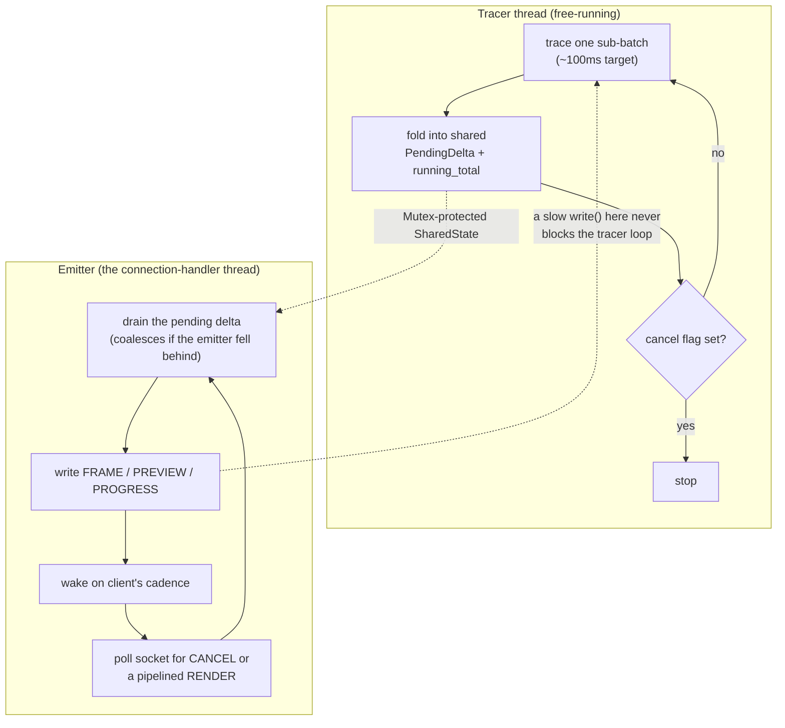
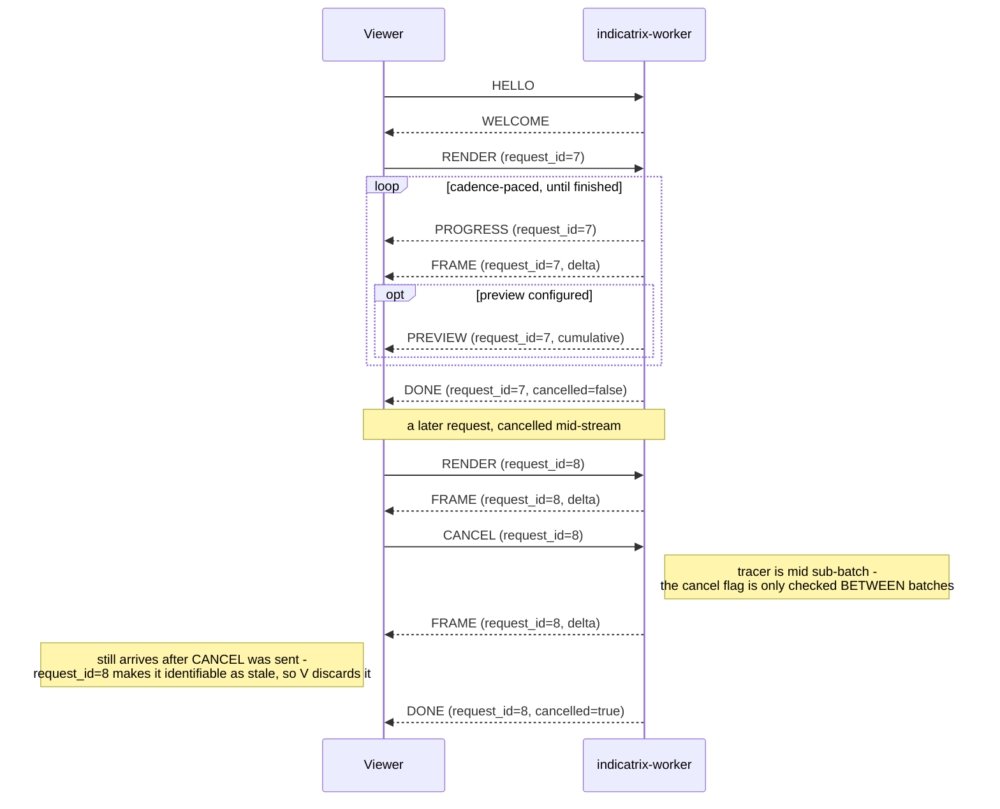

# indicatrix-worker — architecture

How the worker is built internally: how tracing is decoupled from the network, what
makes cancellation mechanical, how concurrent clients are served, and how the GPU
backend fits in. For *using* the worker — flags, certificate workflows, troubleshooting
— see [the README](../README.md). For the trust model and what each security-relevant
flag actually weakens, see [security.md](security.md).

## Two protocols, one connection

`serve`'s primary role is the **design library**: read-only catalogue queries answered
from a SQLite database opened read-only. Rendering is optional on top, behind the
`worker` feature. Both share one listener, one handshake, one authenticated
connection, and one accept loop — a connection is not "a render connection" or "a
library connection", it is a connection over which either kind of message may arrive.

That has two consequences worth stating, because both are easy to get wrong:

- **`WELCOME` is the capability contract.** `library: bool` and
  `render: Option<RenderCapability>` say what this instance actually offers, and
  `render` is `Some` only when a GPU or CPU tracer is genuinely available — not merely
  when the feature compiled. A client checks before sending.
- **The contract is advisory, not enforcement.** Nothing prevents a peer from sending
  a `RenderRequest` to a library-only server anyway, so the dispatch answers with a
  protocol error rather than treating the case as impossible. It was once an
  `unreachable!()`, which would have panicked a connection thread on peer-controlled
  input.

Everything below describes the render path specifically; the library path is a plain
request/response on the same loop, with no streaming, no `request_id` epochs and no
cancellation of its own.

## Architecture notes

### Tracer / emitter split

The tracer never touches the socket. It free-runs over the requested sample
range in adaptively-sized sub-batches (targeting ~100ms each, which bounds both
cancellation latency and scheduling granularity), folding each batch into a
shared accumulation buffer. A **separate** emitter — the same thread already
running the connection handler, not a second thread reading the same socket —
wakes on the client's requested cadence and owns the stream, writing out
whatever hasn't been sent yet (coalesced: unsent deltas sum together losslessly,
exactly like `FRAME` deltas are supposed to). This split exists because coupling
emission directly to sample production would make a fast GPU-class machine stall
on a slow `write()` call and render slower than a weaker machine on a faster
network link.



The two halves only meet at the `Mutex`-protected `SharedState` (`PendingDelta`
+ `running_total`), held only for the brief fold/drain — never across a
`write()`. That's what makes the decoupling real: without it, a slow `write()`
on the emitter side would stall the tracer's next sub-batch, and a fast
machine would render only as fast as its slowest client's link.

### Cancellation

Cancellation is a `CANCEL` message on the existing connection, not a dropped
connection. `request_id` (echoed on every reply from `RENDER` onward) is what
makes "never merge a stale partial into the next render" mechanical: a `CANCEL`
can be in flight past a worker that's already mid-batch, so `FRAME`/`PREVIEW`
payloads for the just-cancelled request may still arrive after it. The worker's
side of this is the same cooperative pattern used elsewhere in this workspace
(an atomic flag the tracer checks *between* sub-batches, never mid-batch): once
observed, the tracer stops and the emitter discards whatever hasn't been sent
yet rather than flushing it — `DONE { cancelled: true }` carries no further
payload. A client pipelining its next `RenderRequest` ahead of a `DONE` for the
current one is treated as an *implicit* cancel of the current one, immediately
followed by the new one — this matches the drag-to-render interaction pattern a
viewer actually uses and avoids a mandatory round trip in the responsiveness
path.



That last `FRAME` is not a bug: the worker had already started that sub-batch
before it next checked the cancel flag, and the reply was already queued
behind the emitter's cadence. `request_id` is what makes discarding it
mechanical rather than requiring the client to reason about timing at all —
"honor/sum/display a payload iff its `request_id` matches the current epoch"
is the whole rule.

### Concurrency model

`serve`'s accept loop (`run`, in `src/serve.rs`) calls `thread::spawn` once
per accepted `TcpStream` — every client gets its own OS thread for the whole
lifetime of its connection, so N simultaneously-connected clients are served
in parallel, not queued behind each other.

`--threads` is a **separate, per-render-request** knob, not a total budget
across those connections. Each `RenderRequest` gets its own tracer thread
(`stream_emit::spawn_tracer`), and that tracer thread's own `trace_samples`
call (`render_core.rs`) further parallelizes a single sub-batch internally
using `thread::scope`, fanning out across `effective_thread_count(threads)`
threads (`0`/omitted resolves to `std::thread::available_parallelism()`, or 8
if that call fails). So the actual number of OS threads doing CPU-bound
tracing at any instant is roughly:

```
(connections currently streaming a request) × (--threads, or all cores if 0/omitted)
```

The operational consequence: if `--threads` is left at its default (all
cores) and several clients trace concurrently, each one's tracer will try to
claim every core for its own sub-batches at the same time as the others —
oversubscription, not a crash, but each client's own throughput (and its
adaptive sub-batch sizing in `next_batch_size`, which targets ~100ms per
batch) degrades as the OS scheduler time-slices more runnable threads than
there are cores. A worker that's meant to serve more than one client at a
time should generally pass an explicit `--threads <n>` sized so that `n ×
(expected concurrent clients)` stays at or under the machine's core count,
rather than relying on the `0` default, which is only appropriate when the
worker is expected to serve one client at a time.

### GPU

Optional, off by default:

```
cargo build -p indicatrix-worker --release --features gpu
```

Both `render` and `serve` then trace on `indicatrix`'s GPU megakernel, falling back to
the CPU tracer per sub-batch whenever the GPU declines. Declining is a normal
outcome, not an error, and happens for three reasons: no usable adapter on this
machine, `--only-cpu`, or an **HDR environment map** (the megakernel has no
`env_mode` for it).

Biaxial materials (Alexandrite, Topaz, Tanzanite) do **not** decline any more.
The `BiaxialIndicatrix` machinery is ported to WGSL and verified at the same
Tier 2 / Tier 3 bar as every other material, so `GemMaterial::gpu_supported()` is
now unconditionally `true` — see that method's own doc comment, and
`indicatrix::renderer::gpu_backend`'s module doc comment for the authoritative
decline list.

`serve` tells the truth about which it is. `WELCOME.backend` reports
`Backend::Gpu { adapter }` **only when an adapter was genuinely acquired at
startup** — not merely when the feature was compiled in — and `Backend::Cpu`
otherwise. Note this is a connection-level signal: the wire protocol carries no
per-request backend field, so a single request that declines (an HDR environment
map arriving in a `SceneState`) still falls back silently for that request alone.

| Flag | Effect |
|---|---|
| `--only-gpu` | GPU only, on both subcommands — never splits work onto the CPU tracer (see "Hybrid CPU+GPU" below), even when the split would otherwise have been offered a share. Still falls back to the CPU tracer for a request/sub-batch the GPU itself declines. Rejected at parse time without the `gpu` feature. |
| `--only-cpu` | Runtime opt-out on both subcommands. For A/B comparison against the CPU tracer, and for routing around a misbehaving adapter without recompiling. What `--no-gpu` (removed) used to do. |
| `--threads` | Still means **CPU** threads. Ignored by GPU dispatch (one compute-pipeline dispatch, not a thread fan-out), but it still governs the CPU fallback — so it remains worth setting even with the GPU active. |
| (neither `--only-*` flag) | Default: hybrid CPU+GPU — see "Hybrid CPU+GPU" below. |

**Hybrid CPU+GPU (the default).** With neither `--only-gpu` nor `--only-cpu` given,
`serve` calibrates a CPU/GPU throughput split for any request of at least 8 samples
(`render_core::hybrid::HYBRID_MIN_SPP`) and, once calibrated, runs the two engines
*concurrently* over disjoint sample sub-ranges for every subsequent sub-batch —
summed, not averaged, so the split changes nothing about correctness, only wall
time. That split is automatically declined (falling back to GPU-only for the rest
of the job, with one `info`-level log line naming the measured share) whenever the
GPU's measured throughput share exceeds a fixed cutoff: on this project's own
reference hardware, splitting measured **42% slower** than GPU-only, because each
sub-batch has to wait for both engines to finish (`max(gpu_time, cpu_time)`, not a
weighted average) and a ~10x-faster GPU leaves little room for that synchronisation
cost to pay for itself. `render`'s single one-shot dispatch never calibrates at all
— there is no long-running batch loop for the split to amortize over — so
`--only-gpu`/`Hybrid` (the default) behave identically there, both simply tracing
through the plain GPU-preferred, CPU-fallback path.

**Cancellation latency is unchanged.** GPU dispatches ride the same adaptive
`TARGET_SUBBATCH` (~100 ms) loop that already bounded the CPU tracer, with the
cancel flag checked *between* sub-batches — a GPU dispatch is simply one more
blocking way to produce one sub-batch, not a new latency class.

**Why this is safe to mix with CPU workers.** A GPU worker's samples remain
additively mergeable with a CPU viewer's: sample ranges stay disjoint and
absolute, buffers are summed rather than averaged, and `indicatrix`'s own Tier 3
check validates CPU and GPU tracing *disjoint* ranges of the same image and
merging the result.

> **This section used to say the opposite**, and was correct when written: the
> WGSL kernels then predated several CPU-side physics corrections, so enabling
> them would have produced silently wrong output. That is no longer true — the
> port is complete through Phase 3 and verified against a real adapter (Tier 2
> per-function ULP budgets at max genuine ULP = 0, energy-conservation furnace
> anchors, Tier 3 statistical image comparison, uniaxial birefringence). Run
> `cargo run --release -p indicatrix --features gpu --example gpu_equivalence_harness`
> to confirm on your own hardware.

