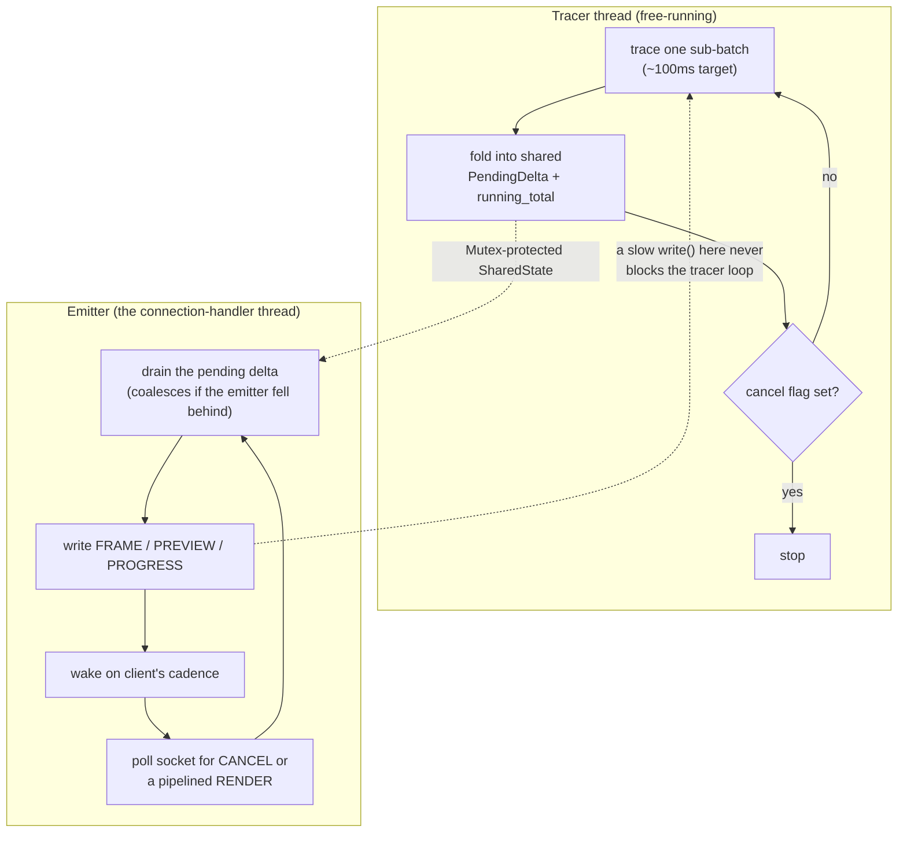
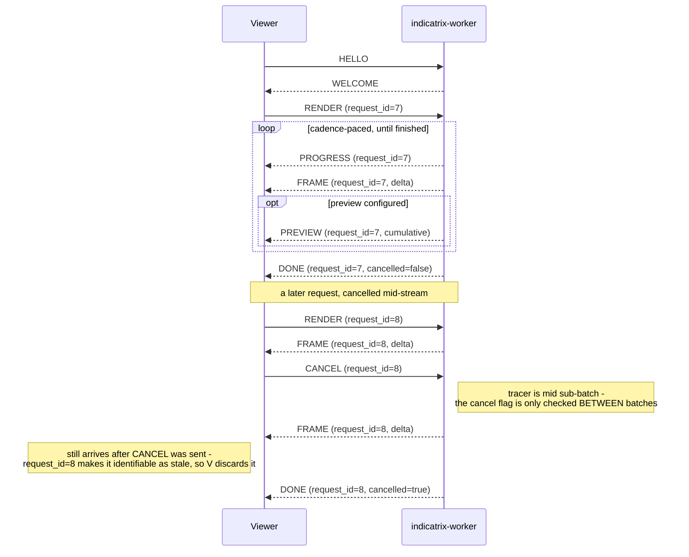

# indicatrix-worker — architecture

How the worker is built internally: how tracing is decoupled from the network, what
makes cancellation mechanical, how concurrent clients are served, how the coordinator
spreads a request over joined workers, and how the GPU backend fits in. For *using* the worker — flags, certificate workflows, troubleshooting
— see [the README](../README.md). For the trust model and what each security-relevant
flag actually weakens, see [security.md](security.md).

## Two protocols, one connection

`serve`'s primary role is the **design library**: read-only catalogue queries answered
from a SQLite database opened read-only. Rendering is optional on top, behind the
`worker` feature. For a viewer, both share one listener (`--bind`), one handshake,
one authenticated connection, and one accept loop — a connection is not "a render
connection" or "a library connection", it is a connection over which either kind of
message may arrive. Joined render workers use a separate listener, the worker port
(see [Coordinator](#coordinator-joined-workers) below).

That has two consequences worth stating, because both are easy to get wrong:

- **`WELCOME` is the capability contract.** `library: bool` and
  `render: Option<RenderCapability>` say what this instance actually offers, and
  `render` is `Some` only when something can genuinely render — the coordinator's own
  lane (`--render`) or at least one joined worker — not merely when the feature
  compiled. A client checks before sending, and a mid-connection `CAPABILITY_CHANGED`
  updates it when workers join or leave.
- **The contract is advisory, not enforcement.** Nothing prevents a peer from sending
  a `RenderRequest` to a library-only server anyway, so the dispatch answers with a
  protocol error rather than treating the case as impossible: treating it as
  impossible (e.g. via `unreachable!()`) would panic a connection thread on
  peer-controlled input.

Everything below describes the render path specifically; the library path is a plain
request/response on the same loop, with no streaming, no `request_id` epochs and no
cancellation of its own.

## Architecture notes

### Tracer / emitter split

The tracer never touches the socket. It free-runs over the requested sample
range in adaptively-sized sub-batches (targeting ~100ms each, which bounds both
cancellation latency and scheduling granularity), folding each batch into a
shared accumulation buffer. A **separate** emitter — the same thread already
running the connection handler, not a second thread reading the same socket —
wakes on the client's requested cadence and owns the stream, writing out
whatever hasn't been sent yet (coalesced: unsent deltas sum together losslessly,
exactly like `FRAME` deltas are supposed to). This split exists because coupling
emission directly to sample production would make a fast GPU-class machine stall
on a slow `write()` call and render slower than a weaker machine on a faster
network link.


```mermaid
flowchart TB
    subgraph Tracer["Tracer thread (free-running)"]
        direction TB
        A1["trace one sub-batch<br/>(~100ms target)"] --> A2["fold into shared<br/>PendingDelta + running_total"]
        A2 --> A3{"cancel flag set?"}
        A3 -- no --> A1
        A3 -- yes --> A4["stop"]
    end

    subgraph Emitter["Emitter (the connection-handler thread)"]
        direction TB
        B1["wake on client's cadence"] --> B2["poll socket for CANCEL or<br/>a pipelined RENDER"]
        B2 --> B3["drain the pending delta<br/>(coalesces if the emitter fell behind)"]
        B3 --> B4["write FRAME / PREVIEW / PROGRESS"]
        B4 --> B1
    end

    A2 -. "Mutex-protected SharedState" .-> B3
    B4 -. "a slow write() here never<br/>blocks the tracer loop" .-> A1
```

The two halves only meet at the `Mutex`-protected `SharedState` (`PendingDelta`
+ `running_total`), held only for the brief fold/drain — never across a
`write()`. That's what makes the decoupling real: without it, a slow `write()`
on the emitter side would stall the tracer's next sub-batch, and a fast
machine would render only as fast as its slowest client's link.

### Cancellation

Cancellation is a `CANCEL` message on the existing connection, not a dropped
connection. `request_id` (echoed on every reply from `RENDER` onward) is what
makes "never merge a stale partial into the next render" mechanical: a `CANCEL`
can be in flight past a worker that's already mid-batch, so `FRAME`/`PREVIEW`
payloads for the just-cancelled request may still arrive after it. The worker's
side of this is the same cooperative pattern used elsewhere in this workspace
(an atomic flag the tracer checks *between* sub-batches, never mid-sub-batch; the
GPU path additionally checks it before every chunk it dispatches, several per
sub-batch on a slow adapter): once observed, the tracer stops and the emitter discards whatever hasn't been sent
yet rather than flushing it — `DONE { cancelled: true }` carries no further
payload. A client pipelining its next `RenderRequest` ahead of a `DONE` for the
current one is treated as an *implicit* cancel of the current one, immediately
followed by the new one — this matches the drag-to-render interaction pattern a
viewer actually uses and avoids a mandatory round trip in the responsiveness
path.


```mermaid
sequenceDiagram
    participant V as Viewer
    participant W as indicatrix-worker

    V->>W: HELLO
    W-->>V: WELCOME

    V->>W: RENDER (request_id=7)
    loop cadence-paced, until finished
        W-->>V: PROGRESS (request_id=7)
        W-->>V: FRAME (request_id=7, delta)
        opt preview configured
            W-->>V: PREVIEW (request_id=7, cumulative)
        end
    end
    W-->>V: DONE (request_id=7, cancelled=false)

    Note over V,W: a later request, cancelled mid-stream
    V->>W: RENDER (request_id=8)
    W-->>V: FRAME (request_id=8, delta)
    V->>W: CANCEL (request_id=8)
    Note right of W: tracer is mid sub-batch -<br/>the cancel flag is only checked BETWEEN batches
    W-->>V: FRAME (request_id=8, delta)
    Note left of V: still arrives after CANCEL was sent -<br/>request_id=8 makes it identifiable as stale, so V discards it
    W-->>V: DONE (request_id=8, cancelled=true)
```

That last `FRAME` is not a bug: the worker had already started that sub-batch
before it next checked the cancel flag, and the reply was already queued
behind the emitter's cadence. `request_id` is what makes discarding it
mechanical rather than requiring the client to reason about timing at all —
"honor/sum/display a payload iff its `request_id` matches the current epoch"
is the whole rule.

### Concurrency model

`serve`'s viewer accept loop (`run_accept_loop`, in `src/serve/accept.rs`) calls
`thread::spawn` once per accepted `TcpStream` — every client gets its own OS thread
for the whole lifetime of its connection, so N simultaneously-connected clients are
served in parallel, not queued behind each other. The worker port's listener
(`src/coordinator/listener.rs`) does the same for joined workers.

`--threads` is a **separate, per-render-request** knob, not a total budget
across those connections. Each `RenderRequest` the own lane traces gets its own tracer
thread (`stream_emit::run_stream` -> `run_stream_with`'s producer thread), and that
tracer thread's own `trace_samples` call (`src/render_core/`) further parallelizes a
single sub-batch internally
using `thread::scope`, fanning out across `effective_thread_count(threads)`
threads (`0`/omitted resolves to `std::thread::available_parallelism()`, or 8
if that call fails). So the actual number of OS threads doing CPU-bound
tracing at any instant is roughly:

```
(connections currently streaming a request) × (--threads, or all cores if 0/omitted)
```

The operational consequence: if `--threads` is left at its default (all
cores) and several clients trace concurrently, each one's tracer will try to
claim every core for its own sub-batches at the same time as the others —
oversubscription, not a crash, but each client's own throughput (and its
adaptive sub-batch sizing in `next_batch_size`, which targets ~100ms per
batch) degrades as the OS scheduler time-slices more runnable threads than
there are cores. A worker that's meant to serve more than one client at a
time should generally pass an explicit `--threads <n>` sized so that `n ×
(expected concurrent clients)` stays at or under the machine's core count,
rather than relying on the `0` default, which is only appropriate when the
worker is expected to serve one client at a time.

### Coordinator (joined workers)

`worker` builds only (`src/coordinator/`). The worker port (`listener.rs`) accepts
`indicatrix-worker join` connections: mutual TLS with a worker-role certificate, a
`HELLO` carrying the worker's `RenderCapability`, a `worker_id` back in
`WELCOME.registration`. Each connection is registered in the `Registry` (`registry.rs`)
as one idle lane; a `join --slots k` worker simply opens k connections. A liveness
thread (`liveness.rs`) sends `PING` every 10 s to idle connections and drops one that
has been silent for 30 s. Viewers are told about joins and departures with
`CAPABILITY_CHANGED` between requests (`viewer.rs`).

A viewer's request is planned before anything is streamed (`job/plan.rs`):

- **Direct** — only the own lane (`--render`) would serve it, e.g. every live-view
  request by default. It is streamed exactly like a single worker: the tracer/emitter
  split above, no chunking.
- **Job** — anything that takes joined workers. An `indicatrix_dispatch::LanePool`
  (from the `crates/indicatrix-dispatch` scheduler crate) hands out disjoint sample
  chunks from one shared cursor to one lane per checked-out worker connection plus the
  own lane, sizing chunks from each lane's measured rate (larger chunks for
  export-type work, smaller ones for live-view work so progress arrives often). A
  failed chunk's unfinished samples go back to the pool; a lane that keeps failing is
  retired; when every lane is gone the viewer gets `ALL_WORKERS_LOST`. The job runs on
  a producer thread (`job/producer.rs`) feeding the same emitter the direct route uses.

  **Rate book.** Each lane's measured rate lives in `RateBook`
  (`coordinator::job::RateBook`), which is coordinator-**process**-wide
  (`Coordinator::rates`), not rebuilt per viewer connection: a GUI export's
  successive one-shot connections share one book, keyed by `LaneKey` (a joined
  worker's certificate label when it has one, else its ephemeral registration id),
  so a worker's calibrated rate survives both across those connections and across
  the worker's own reconnects, instead of restarting from an 8-sample calibration
  probe every chunk. Rates are stored pixel-normalized (samples/sec at a
  reference pixel count) so a rate calibrated at one resolution still reads back
  correctly at another. Chunk sizing is also tail-aware
  (`indicatrix_dispatch::ChunkPolicy::tail_aware_samples`, driven from
  `Epoch::want`): each lane's next chunk is the smaller of the plain
  target-duration chunk and that lane's proportional share (by rate) of the run's
  remaining samples, so a slow lane can no longer claim an oversized slice of what
  is left and leave a fast joined worker idling for the whole of one chunk near
  the end of a run.

Which workers a job takes: a small `Batch` request (its estimated render time on the
fastest eligible worker is under `--whole-image-secs`, or, while no rate is measured,
`width × height × samples` is at most `--whole-image-pixel-samples`) is one picture on
one lane, the fastest idle eligible worker (the own lane only while none is idle). Any
other export-type request (`Batch` intent with `FinalOnly` transfer, and every
`FINAL_IMAGE_REQUEST`) takes every idle worker whose `max_pixels` accepts the image
(and, for an HDR scene, that advertises `hdr`). A live-view request takes the own lane
plus every idle eligible worker by default, or up to `--interactive-workers` of the
fastest (`0`: none besides the own lane; with no own lane, the single fastest worker)
— ranked by rate measured on this viewer connection, unmeasured GPUs first — with
`--pin-interactive-worker`'s worker moved to the front while it is available.

Lanes also come and go while a job runs. Every fan-out job (everything above except the
whole-picture route) watches the registry: a worker that registers, or becomes idle, while
the job is running is checked out and given a lane within one scheduler tick (the registry's
change notification wakes the watcher at once; a connection that merely became idle again is
seen within 50 ms), under the same rules as at job start -- `max_pixels`, `hdr`, the
`--interactive-workers` cap for a live view, and `width × height × 36` bytes per lane against
`--max-job-memory-mib` (a lane that does not fit is not added). The late lane claims from the
job's one sample cursor, requeued ranges first, and its first chunk is half-sized when its
worker's rate is known, so it does not stampede. Joining mid-run cannot change which
samples make up the picture, only which lane traces which chunk: the merge folds chunks in
chunk-start order whichever lane finished them. A lane whose worker's connection broke (a
chunk, or the lane's own heartbeat, found it dead) is removed from the pool as soon as its
unfinished range is back on the cursor, without a backoff, provided another lane (the own
lane included) remains; the last lane keeps the ordinary retry schedule, and a job whose
lanes are all gone ends with `ALL_WORKERS_LOST` as before. A worker that reconnects after a
crash is a new worker with a new id and gets a new lane the same way. A finished job takes no
more workers, and a request that was routed to the own lane alone (`Direct`) never grows lanes.

Limits (`job/limits.rs`): every job reserves `width × height × 48` bytes (four
full-resolution `Vec3` buffers) against `--max-job-memory-mib` and is refused past it;
export-type jobs wait in a per-viewer FIFO so one viewer certificate has one such job
running at a time; whole-picture jobs instead count against `--jobs-per-viewer`
(default 8). Live-view and direct requests are exempt.

What the viewer receives: `FRAME`s carry the sum of every chunk merged since the last
emit — a *set* of samples inside the request range, so clients check containment,
never contiguity; under `FinalOnly` the one `FRAME` is the pool's deterministic merge
in chunk-start order, so the result does not depend on which lane finished first.
`DISPLAY_FRAME`s (live view, `TransferMode::DisplayOnly`) are the merged sum averaged,
denoised and tone-mapped with the GUI's own pipeline — `indicatrix::renderer::frame_denoise`,
with guide buffers from the coordinator's own primary-ray prepass
(`indicatrix::renderer::guide_pass`, computed once per request from pose and
geometry) — with at most one denoise in flight, identically for a job and for the
direct route (`src/stream_emit/emitter/display.rs`). `FINAL_IMAGE` is the merged sum
tone-mapped with the GUI export's own function and PNG-encoded
(`src/stream_emit/emitter/picture.rs`).

Joined lanes (`src/coordinator/lanes/`) talk to their worker like a viewer would: one
`RenderRequest` per chunk, containment-checked `FRAME`s, the same two-tier liveness
deadline as the GUI (30 s for the first event, 8 s after), and on cancel a `CANCEL`
followed by a bounded 10 s wait for `DONE`. A worker that asks for an HDR map
(`NEED_ASSET`) is answered from the copy the coordinator holds for the job
(`src/assets/`), so a viewer uploads each map at most once.

The handshake still negotiates a payload encoding per connection (each side lists what
it can decode, the server picks its first preference the peer accepts, `WELCOME` names
it), but that is only the connection's default: every frame is encoded for the link
speed measured while the connection runs, see "Adaptive payload compression" below. All
encodings are lossless.

### Adaptive payload compression

Which codec is best depends on the link: a slow one pays for a smaller payload with CPU
time, a fast one sends raw floats. A link can also change speed between two jobs. So
every sender of `FRAME`, `PREVIEW` and `DISPLAY_FRAME` payloads (a joined worker toward
its coordinator, the coordinator toward each viewer, the desktop's `CONTRIBUTION`
upload) keeps **one `PeerLink` per peer connection**
(`indicatrix_net::messages::adaptive`) and encodes each frame for what that connection
last measured. The decoders dispatch on the encoding named in each frame header, so
consecutive frames may differ and nothing changed on the wire.

**Measurement.** Only the blocking socket write of a frame is timed (never compression,
never a channel wait): the emitter writes straight to the TCP or TLS stream, and
`PeerLink::send_payload`/`send_display` start the clock after encoding and stop it when the
write returns. The sample is the wire bytes (payload plus about 64 bytes of header and
framing) over that duration, folded into an exponentially weighted estimate in Mbit/s
that falls quickly (weight 0.6 when a sample is below 80 % of the estimate) and rises
slowly (0.15). A write under 256 KiB says nothing about the link, since the kernel send
buffer swallows it, so consecutive small writes are summed until they reach 256 KiB and
the sum becomes one sample (`WriteAggregator`); such a sum may only lower the estimate,
because each part may have fitted in the buffer. A failed write is never measured.

**Tiers.** The estimate selects a rung of the ladder 50, 100, 300, 1000, 2500 and 10000
Mbit/s by the 50 % rule: the next higher tier once the estimate is more than halfway to
it, with a 15 % hysteresis band around each boundary so a link at a boundary does not
flip tier every frame. The first estimate places the tier directly; a connection with no
estimate starts on 300 Mbit/s. Every tier switch is logged at `debug` with the peer, the
estimate and the old and new tier; each connection logs once at `info` whether it is
adaptive or fixed.

**The matrix.** The encoding for a (payload size class, tier) cell is read from the
generated table `crates/indicatrix-net/src/messages/encoding_matrix.rs`: an ordered
preference list per cell (zstd level 3 or 1 on the slow tiers, LZ4 at 1000 and 2500
Mbit/s, raw at 10000), and PNG or raw RGBA8 for display frames.
The list is filtered by what the peer announced in its `HELLO` `accept_encodings`; the
`WELCOME` encoding is not a cap. A payload that does not shrink still goes out raw, as
its header says. The matrix comes from measurements: regenerate it on the machines in
question with

```
cargo run -p indicatrix-worker --release --example payload_codec_bench -- --large --emit-matrix --matrix-out crates/indicatrix-net/src/messages/encoding_matrix.rs
```

and review the diff. `--simulate` in the same example replays the policy against a
modelled link without a network.

**Loopback and overrides.** A peer on a loopback address always gets raw payloads and raw
RGBA8 pictures under `auto`: memory bandwidth beats every codec. `--payload-encoding
auto|raw|lz4|zstd[:LEVEL]` on `serve` (toward viewers) and `join` (toward the
coordinator) pins one encoding instead (when the peer accepts it, else raw), on every
link including loopback, and turns the measurement off. The desktop's `payload_encoding`
setting does the same for its uploads. A `FINAL_IMAGE` is always a PNG, since it is the
export's product, but its write is timed like any other frame.

**Seeding.** A process-wide, bounded (64 peers, oldest forgotten first), in-memory
`BTreeMap` remembers the last estimate per peer: a joined worker keys it by the
coordinator's address, the coordinator by the viewer's certificate fingerprint (its IP
address without TLS), the desktop by the coordinator's address. It is stored when a
connection ends and when its tier switches, and read when the next connection to the same
peer opens. A stale value only costs the first frames: the estimator corrects it.

**Memory.** The encoder keeps scratch buffers and a compression context (up to roughly
twice a frame at 4K). They are released when a request ends, after eight raw payloads in
a row, and whenever the chosen encoding changes.

### GPU

Optional, off by default:

```
cargo build -p indicatrix-worker --release --features gpu
```

`render`, `serve --render` and `join` then trace on `indicatrix`'s GPU megakernel, falling back to
the CPU tracer per sub-batch whenever the GPU declines. Declining is a normal
outcome, not an error, and happens for three reasons: no usable adapter on this
machine (or a device lost mid-run), `--only-cpu`, or an **HDR environment map too
large** for the device's storage-buffer limit. HDR maps otherwise render on the GPU —
the megakernel has its own environment mode for them.

**Device loss.** A device that stops responding (or a renderer left unusable by
a panic) is a decline like the others, for the request that hits it and for
every request after it until the device comes back. The decline is clean: the
GPU backend traces each request into its own scratch buffer and adds it to the
worker's buffer only when the whole request completed, so a loss on a late turn
leaves that buffer all-zero and the CPU tracer re-traces the full sample range
without double counting what the GPU had already finished. Loss is not
permanent. After a 30 s cool-down (measured from the loss, and again from each
failed attempt) the next request acquires a fresh adapter and compiles a new
renderer; if that succeeds the GPU serves again, otherwise the worker stays on
the CPU tracer. At most 6 attempts start per hour, so a dead device is not
hammered. A worker that found no adapter at start-up never retries. A joined
worker recomputes the backend it advertises on every reconnect, giving a lost
device its attempt first, so it re-registers as `Gpu` after a recovery and as
`Cpu` while the GPU is down; a connection that stays up keeps the capability
it registered with.

Biaxial materials (Alexandrite, Topaz, Tanzanite) do **not** decline.
The `BiaxialIndicatrix` machinery is ported to WGSL and verified at the same
Tier 2 / Tier 3 bar as every other material, so `GemMaterial::gpu_supported()` is
unconditionally `true` — see that method's own doc comment, and
`indicatrix::renderer::gpu_backend`'s module doc comment for the authoritative
decline list.

`serve --render` tells the truth about which it is. `WELCOME.render.backend` reports
`Backend::Gpu { adapter }` **only when an adapter was genuinely acquired and is
currently usable** — not merely when the feature was compiled in — and `Backend::Cpu`
otherwise (a `join`ed worker reports the same in its `HELLO`; a coordinator with
joined workers reports `Backend::Coordinator` with the summed threads and GPUs).
Without `--render`, `serve` never acquires a GPU at all. Note this is a connection-level signal: the wire protocol carries no
per-request backend field, so a single request that declines (an oversized HDR
environment map, say) still falls back silently for that request alone.

| Flag | Effect |
|---|---|
| `--only-gpu` | GPU only, on every subcommand that traces — never splits work onto the CPU tracer (see "Hybrid CPU+GPU" below), even when the split would otherwise have been offered a share. Still falls back to the CPU tracer for a request/sub-batch the GPU itself declines. Rejected at parse time without the `gpu` feature. |
| `--only-cpu` | Runtime opt-out on every subcommand that traces. For A/B comparison against the CPU tracer, and for routing around a misbehaving adapter without recompiling. |
| `--threads` | Still means **CPU** threads. Ignored by GPU dispatch (one compute-pipeline dispatch, not a thread fan-out), but it still governs the CPU fallback — so it remains worth setting even with the GPU active. |
| (neither `--only-*` flag) | Default: hybrid CPU+GPU — see "Hybrid CPU+GPU" below. |

**Hybrid CPU+GPU (the default).** With neither `--only-gpu` nor `--only-cpu` given,
`serve --render` (and `join`) calibrates a CPU/GPU throughput split for any request of at least 8 samples
(`render_core::hybrid::HYBRID_MIN_SPP`) and, once calibrated, runs the two engines
*concurrently* over disjoint sample sub-ranges for every subsequent sub-batch —
summed, not averaged, so the split changes nothing about correctness, only wall
time. That split is automatically declined (falling back to GPU-only for the rest
of the job, with one `info`-level log line naming the measured share) whenever the
GPU's measured throughput share exceeds a fixed cutoff: on this project's own
reference hardware, splitting measured **42% slower** than GPU-only, because each
sub-batch has to wait for both engines to finish (`max(gpu_time, cpu_time)`, not a
weighted average) and a ~10x-faster GPU leaves little room for that synchronisation
cost to pay for itself. `render`'s single one-shot dispatch never calibrates at all
— there is no long-running batch loop for the split to amortize over — so
`--only-gpu`/`Hybrid` (the default) behave identically there, both simply tracing
through the plain GPU-preferred, CPU-fallback path.

**Calibration is cached process-wide, not re-run per job.** `calibrate_cached`
(`render_core::hybrid`) keys a `BTreeMap` cache by `JobKey` — GPU adapter identity,
realized thread count, `ComputeMode`, and the scene's resolution rounded up to the
enclosing power of two — and stores the DECISION (GPU-only, or a split seeded at a
`gpu_frac`), not the raw measurement. The very first job matching a given resource
profile pays the 3-sample probe (`calibrate`) and fills the cache; every later job on
that same profile (another `RenderRequest`, another coordinator lane chunk, another
live Direct request) skips the probe entirely and starts from the cached decision.
In `Hybrid` mode with a GPU adapter present, `serve` and `join` already pay that probe
once at start-up on a representative scene (`hybrid::calibrate_now`), so the first
real request normally hits the cache too.
Each job still re-measures its own split from there via the 0.7-old/0.3-new moving
average above, and the job's own final blended `gpu_frac` is written back into the
cache when it ends (`finalize_split_cache`), so the seed keeps improving across jobs.
Deliberately not keyed on the scene's material/geometry/lighting or which samples are
traced — those shift both engines' per-sample cost together, not their relative
split, so a wrong guess there self-corrects within one job.

**Cancellation latency is unchanged.** GPU dispatches ride the same adaptive
`TARGET_SUBBATCH` (~100 ms) loop that already bounded the CPU tracer, with the
cancel flag checked *between* sub-batches — a GPU dispatch is simply one more
blocking way to produce one sub-batch, not a new latency class. Inside a GPU
sub-batch the flag is also checked before each chunk is dispatched (a chunk is
sized to about 150 ms once the adapter has been timed, and a turn is two
chunks), so a long sub-batch on a slow adapter stops sooner than the next
sub-batch boundary. A cancelled or declined GPU sub-batch writes nothing into
the worker's buffer; see "Device loss" above.

**Why this is safe to mix with CPU workers.** A GPU worker's samples remain
additively mergeable with a CPU viewer's: sample ranges stay disjoint and
absolute, buffers are summed rather than averaged, and `indicatrix`'s own Tier 3
check validates CPU and GPU tracing *disjoint* ranges of the same image and
merging the result.

The GPU port is verified against a real adapter (Tier 2 per-function ULP
budgets at max genuine ULP = 0, energy-conservation furnace anchors, Tier 3
statistical image comparison, uniaxial birefringence). Run
`cargo run --release -p indicatrix --features gpu --example gpu_equivalence_harness`
to confirm on your own hardware.

