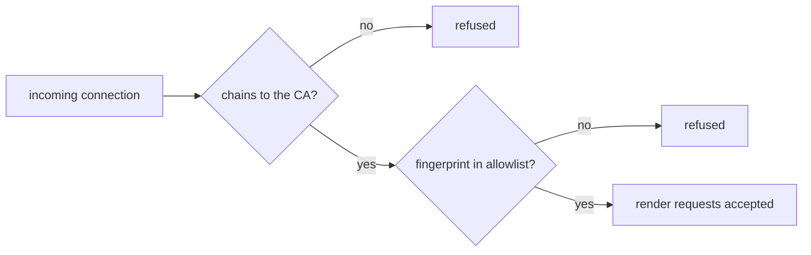
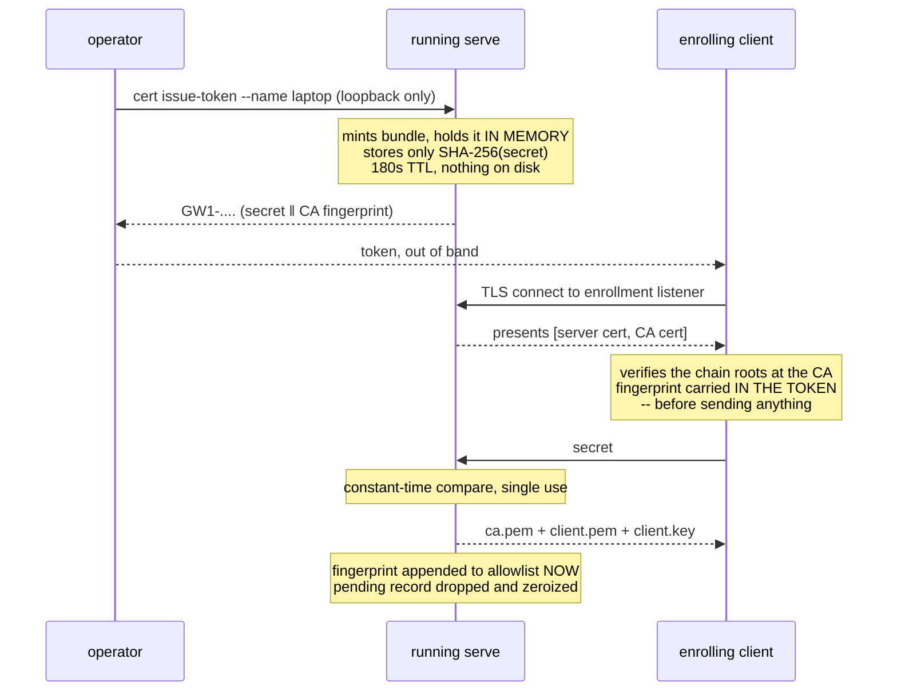

# indicatrix-worker — trust model

What `serve` actually protects, what it doesn't, and what each security-relevant flag
costs you. For the commands themselves see [the README](../README.md); for how the
worker is built internally see [architecture.md](architecture.md).

`serve` is a network service that accepts caller-supplied geometry and traces it. That
makes two questions load-bearing: *who may connect*, and *what may they make this
machine do*. They are answered by different mechanisms and it is worth keeping them
apart.

## Who may connect

Two independent gates, both of which must pass:

1. **Chain of trust.** The client presents a certificate signed by the same private CA
   as the worker's own. Mutual TLS — the client verifies the worker too.
2. **The allowlist.** The client certificate's SHA-256 fingerprint must appear in
   `allowlist.txt`.

The second is not redundant. The CA answers "was this certificate issued by me"; the
allowlist answers "is *this specific* certificate still welcome". Without it, every
certificate the CA ever signed is valid forever, because **there is no CRL and no
OCSP** — revocation *is* deleting a line from the allowlist. That file is re-read on
every connection, so a deletion takes effect immediately, with no restart.

## Enrollment: how a client gets its certificate

Two paths, both supported, with different trade-offs.

### Manual (`cert issue-client`)

Writes `ca.pem`/`client.pem`/`client.key` to a directory and appends the fingerprint to
the allowlist **immediately**. You copy the directory to the viewer's machine yourself.

Kept deliberately: air-gapped and offline setups have nothing to dial out to. It is also
the only path where the allowlist gains an entry before anyone has actually taken
delivery of the certificate — which is the thing the token path improves on.

### Token (`cert issue-token` → `cert claim`)

The operator asks a *running* `serve` process for a one-time token and reads it out. The
enrolling machine redeems it and receives the same three-file bundle.

Three properties are what make this safe, and each was a deliberate choice:

**The token is not the certificate's fingerprint.** It is a fresh 256-bit CSPRNG secret.
The fingerprint is a *public* value — it crosses the wire in the clear on every
handshake and is the allowlist's permanent identifier for that client. A bearer secret
and a long-term public identifier must never be the same value.

**The server never stores the secret.** Only `SHA-256(secret)`, compared in constant
time against every pending entry with no early exit, so a compromise of the running
worker yields nothing redeemable and the comparison's duration doesn't reveal which
entry matched.

**The token commits to the server's identity.** This is the subtle one. An enrolling
client has no CA certificate yet — that is the bootstrap problem. If it trusted whatever
answered, an attacker could impersonate the worker, relay to the real one, and walk away
holding a **valid client certificate**. So the token carries the CA's SHA-256 fingerprint
alongside the secret, and the client verifies the presented chain against it *before*
sending anything. Pinning is trust-anchor *selection* only: once the anchor is chosen,
the whole chain/signature/validity check is delegated to `rustls`'s own
`WebPkiServerVerifier`. Nothing is skipped.

### What a stolen token gets an attacker

A client certificate for your CA, if they redeem it before the legitimate holder does
and within 180 seconds of issuance. That is the real exposure and it is why the window
is short and the token single-use.

Mitigations already in place: the token expires, a successful claim consumes it, and the
allowlist entry appears **only on claim** — so an unclaimed or expired token leaves no
trace and grants nothing. If you suspect a token was intercepted, the legitimate holder
will find their claim fails (single use), which is itself the signal.

### Known limitation: the private key transits

The bundle contains `client.key`, so the worker generates and transmits the client's
private key. A private key ideally never leaves the machine it belongs to.

The stronger design is a CSR flow: the client generates its own keypair and sends a
signing request; the worker returns only the signed certificate, and no private key ever
crosses the wire. That is a deliberate follow-up rather than an oversight — it requires
the client side (`apps/indicatrix-cut`) to generate keypairs, so it could not land with the
worker-side change alone.

Until then, treat the enrollment connection as carrying key material: it is TLS-protected
and server-verified, but a compromise of the worker at that moment is a compromise of
that client's key.

### Other properties worth knowing

- **`serve` needs `ca.key` when enrollment is enabled** — minting a certificate
  requires signing. `--no-enroll` avoids this entirely.
- **A `serve` restart drops every pending enrollment.** Fail-closed, and intended:
  pending bundles live only in memory.
- **`cert issue-token` is honoured only from a loopback peer**, enforced against the real
  `peer_addr()` rather than by how the listener is bound.
- Key material is held in `Zeroizing` wrappers so ordinary `Drop` overwrites it. Nothing
  protects against an abrupt process kill.

## What each flag weakens

| Flag | What you give up |
|---|---|
| `--trust-any-client-cert` | The allowlist. Any certificate the CA ever signed is accepted, forever — you lose per-client revocability entirely, keeping only "was it signed by my CA". |
| `--allow-remote` | Loopback-only binding. Required for any real remote worker; it exists so that exposing the machine is a visible, deliberate act rather than a default. |
| `--insecure-no-tls` | Everything: no TLS, no authentication, no client identity. Refused on a non-loopback bind, and every accepted connection logs a warning. Local debugging only. |
| `--no-enroll` | The token path. The manual `cert issue-client` workflow still works; this just opens no extra port. |

## What this does *not* protect against

Stated plainly, because a trust model that only lists its strengths is misleading:

- **A compromised CA private key.** Whoever holds `ca.key` can mint certificates that
  pass both gates. It is ACL-restricted at rest (on Windows, via `icacls` to the current
  user, SYSTEM and Administrators), but there is no HSM and no key ceremony.
- **A malicious but allowlisted client.** Authorization is binary. An accepted client can
  submit any scene within [the validation limits](../README.md#limits-and-validation) —
  which is exactly why those limits exist and are enforced before geometry reaches the
  tracer.
- **Traffic analysis.** TLS hides content, not the fact or size of a render.
- **Certificate expiry as revocation.** Client certificates last five years. The
  allowlist is the revocation mechanism; do not rely on expiry.
